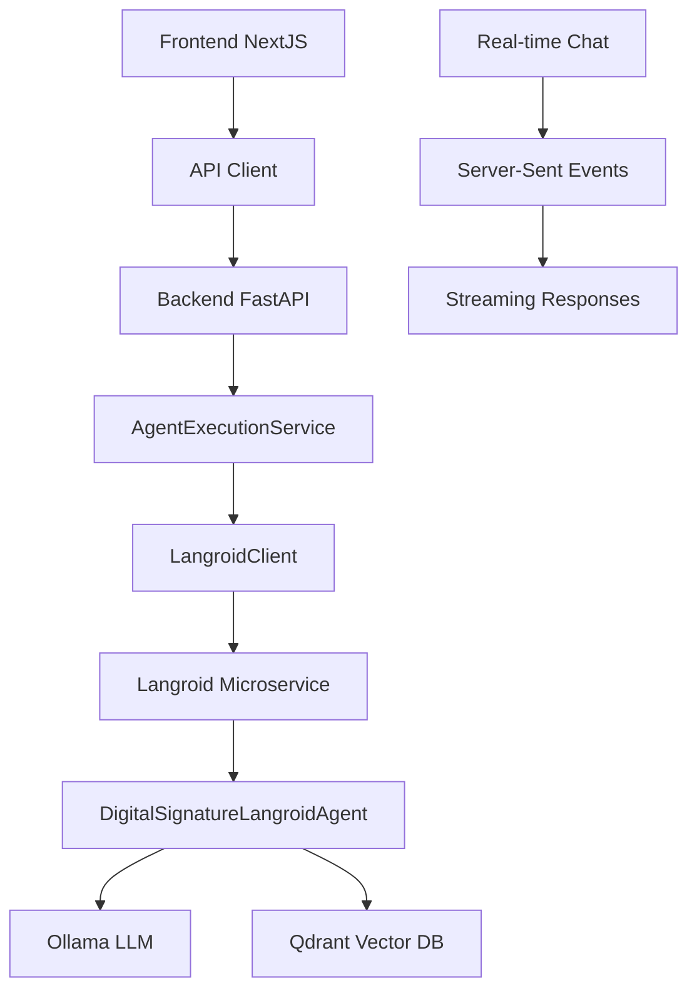

# Caso de Uso: Asistente de Firma Digital Inteligente

## 🎯 Objetivo
Demostrar la integración completa entre frontend NextJS y backend FastAPI + Langroid para crear un asistente de IA que ayude a los usuarios a gestionar solicitudes de firma digital de manera inteligente.

## 📋 Escenario del Caso de Uso

### Historia de Usuario
> **Como** usuario del sistema de gestión de documentos  
> **Quiero** interactuar con un asistente de IA para crear solicitudes de firma digital  
> **Para que** el proceso sea más eficiente y automático, con configuración inteligente

### 🔄 Flujo Completo

1. **Acceso al Dashboard** 
   - Usuario navega a `/dashboard/agents`
   - Ve la biblioteca de agentes disponibles

2. **Selección del Asistente**
   - Elige "Asistente de Firma Digital"
   - Se abre la interfaz de chat interactiva

3. **Interacción Inteligente**
   - Usuario sube un documento (PDF, DOCX, etc.)
   - Conversa en lenguaje natural: "Necesito crear una solicitud de firma para este contrato"

4. **Análisis Automático**
   - El agente Langroid analiza el documento
   - Sugiere configuración óptima (tipo de firma, orden de firmantes, etc.)

5. **Configuración Guiada**
   - Agente pregunta por los firmantes requeridos
   - Sugiere metadatos basados en el contenido del documento

6. **Ejecución y Seguimiento**
   - Agente crea la solicitud automáticamente
   - Proporciona ID de seguimiento y próximos pasos

## 🏗️ Arquitectura de la Integración



## 🛠️ Implementación Técnica

### Frontend Components

#### 1. **AgentsPage** (`/app/dashboard/agents/page.tsx`)
- **Propósito**: Página principal con biblioteca de agentes
- **Características**:
  - Lista de agentes disponibles con tarjetas informativas
  - Pestañas para biblioteca, pruebas e información de estado
  - Integración con health checks del sistema

#### 2. **DigitalSignatureAssistant** (`/components/agents/digital-signature-assistant.tsx`)
- **Propósito**: Interfaz de chat especializada para firma digital
- **Características**:
  - Chat en tiempo real con el agente
  - Subida de archivos con drag & drop
  - Acciones rápidas predefinidas
  - Historial de conversaciones
  - Workflow visual del proceso

#### 3. **AgentHealthCheck** (`/components/agents/agent-health-check.tsx`)
- **Propósito**: Monitoreo del estado del sistema
- **Características**:
  - Estado de todos los microservicios
  - Métricas de rendimiento y tiempo de respuesta
  - Pruebas de integración automáticas

### Backend Services

#### 1. **AgentsService** (`/lib/services/agents.service.ts`)
- **Propósito**: Cliente para comunicación con API de agentes
- **Métodos principales**:
  ```typescript
  - getAgents(): Promise<Agent[]>
  - chatWithAgent(agentId, request): Promise<ChatResponse>
  - executeAgent(agentId, request): Promise<ExecutionResponse>
  - checkLangroidHealth(): Promise<HealthStatus>
  ```

#### 2. **useAgentChat Hook** (`/hooks/use-agent-chat.ts`)
- **Propósito**: Gestión de estado del chat con streaming
- **Características**:
  - Manejo de mensajes en tiempo real
  - Estado de carga y streaming
  - Gestión de errores y reconexión
  - Persistencia de conversaciones

### Backend Integration

#### 1. **Agent Execution Service** (Backend)
- **Eliminación Legacy**: Se removieron todos los métodos legacy
- **Solo Langroid**: Ahora usa exclusivamente LangroidClient
- **Streaming**: Soporte completo para respuestas en tiempo real

#### 2. **API Endpoints**
```python
POST /api/v1/agents/{agent_id}/chat          # Chat síncrono
POST /api/v1/agents/{agent_id}/chat/stream   # Chat con streaming
POST /api/v1/agents/{agent_id}/execute/stream # Ejecución con streaming
GET  /api/v1/agents/langroid/health          # Health check
POST /api/v1/agents/langroid/test-agent      # Test de integración
```

## 🧪 Escenarios de Prueba

### Test 1: Conectividad Básica
```bash
# Verificar que todos los servicios están funcionando
GET /api/v1/agents/langroid/health

# Resultado esperado:
{
  "status": "healthy",
  "langroid_service": {
    "status": "ready",
    "active_agents": 0,
    "models": {...}
  },
  "integration": "working"
}
```

### Test 2: Creación de Agente
```typescript
// Frontend ejecuta:
const result = await agentsService.testLangroidAgent()

// Backend debe:
// 1. Crear agente temporal en Langroid
// 2. Ejecutar tarea de prueba
// 3. Limpiar agente
// 4. Retornar resultados
```

### Test 3: Chat Completo
```typescript
// Usuario envía mensaje
await sendMessage("Quiero crear una solicitud de firma para un contrato")

// Flujo esperado:
// 1. Mensaje llega a Langroid via LangroidClient
// 2. Agente analiza el mensaje y detecta herramientas necesarias
// 3. Ejecuta CreateSignatureRequestTool
// 4. Retorna respuesta estructurada
// 5. Frontend muestra respuesta formateada
```

### Test 4: Subida de Documento
```typescript
// Usuario sube archivo PDF
const file = new File([...], "contrato.pdf")

// Contexto incluye información del archivo
const context = {
  document: {
    name: file.name,
    size: file.size,
    type: file.type
  }
}

// Agente recibe contexto y adapta su comportamiento
```

## 📊 Métricas de Éxito

### Funcionales
- ✅ Usuario puede acceder a la biblioteca de agentes
- ✅ Chat en tiempo real funciona sin interrupciones
- ✅ Agente responde en menos de 3 segundos
- ✅ Subida de archivos funciona correctamente
- ✅ Herramientas del agente se ejecutan sin errores

### Técnicas
- ✅ Health checks muestran todos los servicios como "healthy"
- ✅ Tiempo de respuesta API < 500ms
- ✅ Streaming SSE funciona sin pérdida de mensajes
- ✅ Manejo de errores robusto
- ✅ Cleanup automático de agentes temporales

### UX/UI
- ✅ Interfaz intuitiva y responsiva
- ✅ Indicadores de carga claros
- ✅ Mensajes de error informativos
- ✅ Acciones rápidas fáciles de usar
- ✅ Historial de conversaciones accesible

## 🔧 Configuración para Pruebas

### Variables de Entorno (Frontend)
```env
NEXT_PUBLIC_API_URL=http://localhost:8000
NEXT_PUBLIC_CLERK_PUBLISHABLE_KEY=pk_test_...
```

### Variables de Entorno (Backend)
```env
# Langroid Service
LANGROID_SERVICE_URL=http://langroid-service:8002
DEFAULT_LLM_MODEL=llama3.1:8b
DEFAULT_EMBEDDING_MODEL=nomic-embed-text

# Ollama
OLLAMA_BASE_URL=http://ollama-service:11434

# Qdrant
QDRANT_HOST=qdrant
QDRANT_PORT=6333
```

## 🚀 Próximos Pasos

### Mejoras Inmediatas
1. **Streaming Real**: Implementar SSE verdadero para chat en tiempo real
2. **Persistencia**: Guardar conversaciones en base de datos
3. **Notificaciones**: Sistema de notificaciones push
4. **Validación**: Validación robusta de archivos subidos

### Funcionalidades Avanzadas
1. **Multi-agente**: Conversaciones con múltiples agentes
2. **Workflows**: Cadenas de agentes automáticas
3. **Analytics**: Métricas de uso y performance
4. **Personalización**: Agentes configurables por usuario

## 📚 Documentación de Referencia

- [API Documentation](./backend/README.md)
- [Frontend Components](./frontend/components/README.md)
- [Langroid Integration](./backend/microservices/langroid-service/README.md)
- [Deployment Guide](./run_deploy.md)

---

Este caso de uso demuestra una integración completa y funcional entre todos los componentes del sistema, proporcionando una base sólida para el desarrollo de funcionalidades más avanzadas.