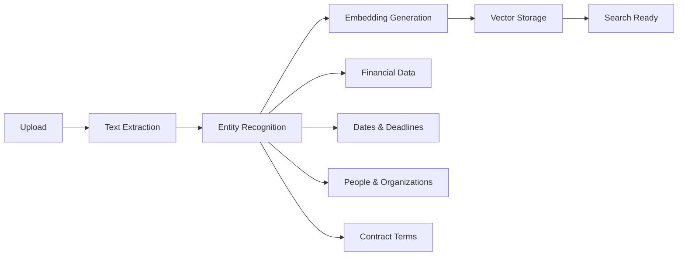

# NexusDocs360 - Technical Architecture for Investors

**Enterprise AI-Powered Document Intelligence Platform**

---

## Executive Summary

NexusDocs360 is a cloud-native, multi-tenant document intelligence platform that transforms enterprise knowledge bases into intelligent, action-ready assets. Built on a modern microservices architecture with GPU-accelerated AI capabilities, the platform delivers autonomous document understanding, semantic search, and workflow automation.

| Metric | Value |
|--------|-------|
| **Target Market** | Mid-market legal, compliance, and operations teams (50–5,000 employees) |
| **Deployment Model** | SaaS (Google Cloud Platform) with enterprise single-tenant options |
| **Revenue Model** | Stripe-backed tiered subscriptions + usage-based AI add-ons |
| **Architecture** | 15+ microservices, GPU-accelerated inference, multi-provider LLM |

---

## 1. Platform Architecture Overview

### 1.1 System Architecture Diagram

```
┌─────────────────────────────────────────────────────────────────────────────┐
│                           CLIENT LAYER                                       │
├─────────────────────────────────────────────────────────────────────────────┤
│  Next.js 15 Frontend      │    Admin Portal      │    Mobile Apps (Future)  │
│  (App Router + TypeScript) │    (React)           │    (React Native)        │
└─────────────────────────────────┬───────────────────────────────────────────┘
                                  │ HTTPS / WebSocket
                                  ▼
┌─────────────────────────────────────────────────────────────────────────────┐
│                        API GATEWAY LAYER                                     │
├─────────────────────────────────────────────────────────────────────────────┤
│  FastAPI Main Gateway (Port 8000)                                           │
│  ├── Authentication (Clerk JWT Validation)                                  │
│  ├── Multi-Tenant Routing & Isolation                                       │
│  ├── Rate Limiting (Redis-backed)                                           │
│  ├── Request Logging & Metrics (Prometheus)                                 │
│  └── API Versioning (v1)                                                    │
└─────────────────────────────────┬───────────────────────────────────────────┘
                                  │
        ┌─────────────────────────┼─────────────────────────┐
        ▼                         ▼                         ▼
┌───────────────────┐   ┌───────────────────┐   ┌───────────────────┐
│   BUSINESS LOGIC  │   │   AI/ML SERVICES  │   │  INFRASTRUCTURE   │
├───────────────────┤   ├───────────────────┤   ├───────────────────┤
│ Document Service  │   │ Emma AI (Agents)  │   │ PostgreSQL 15     │
│ Search Service    │   │ vLLM Server (GPU) │   │ Redis 7           │
│ Signature Service │   │ TEI Embeddings    │   │ Weaviate 1.28     │
│ Auth Service      │   │ LangExtract       │   │ Elasticsearch 8.11│
│ Subscription Svc  │   │ TextExtract/Tika  │   │ Google Cloud      │
│ Email Service     │   │ TTS (VibeVoice)   │   │ Storage (GCS)     │
└───────────────────┘   └───────────────────┘   └───────────────────┘
        │                         │                         │
        └─────────────────────────┴─────────────────────────┘
                                  │
                                  ▼
┌─────────────────────────────────────────────────────────────────────────────┐
│                        ORCHESTRATION LAYER                                   │
├─────────────────────────────────────────────────────────────────────────────┤
│  Camunda BPM 7.22           │    Celery + Redis     │    Background Worker  │
│  (BPMN Workflow Engine)     │    (Task Queue)       │    (Async Processing) │
└─────────────────────────────────────────────────────────────────────────────┘
```

### 1.2 Technology Stack Summary

| Layer | Technologies | Purpose |
|-------|-------------|---------|
| **Frontend** | Next.js 15, TypeScript 5.7, Tailwind CSS, shadcn/ui | Modern React framework with App Router |
| **Backend API** | FastAPI, Python 3.9+, SQLAlchemy 2.0, Alembic | High-performance async API framework |
| **Authentication** | Clerk (SSO, MFA) + Stripe (Subscriptions) | Enterprise-grade identity & billing |
| **AI/ML** | vLLM, Microsoft Agent Framework, TEI | GPU-accelerated LLM inference |
| **Vector DB** | Weaviate 1.28.3 | Semantic search with 1024-dim embeddings |
| **Search** | Elasticsearch 8.11 | Full-text search with hybrid capabilities |
| **Database** | PostgreSQL 15 | Multi-tenant relational data |
| **Cache** | Redis 7 | Sessions, rate limiting, task queues |
| **Storage** | Google Cloud Storage | Tenant-isolated document storage |
| **Workflows** | Camunda BPM 7.22 | BPMN-based approval workflows |
| **Containers** | Docker, Docker Compose | Microservices orchestration |

---

## 2. AI/ML Architecture

### 2.1 Emma AI - Autonomous Agent System

Emma is our proprietary AI orchestrator built on the **Microsoft Agent Framework**, providing multi-agent coordination for complex document tasks.

```
┌─────────────────────────────────────────────────────────────────┐
│                     EMMA AI ORCHESTRATOR                         │
│          (Microsoft Agent Framework + RAG Pipeline)              │
└────────────────────────┬────────────────────────────────────────┘
                         │
         ┌───────────────┼───────────────┐
         │               │               │
   ┌─────▼─────┐   ┌────▼──────┐  ┌────▼────────┐
   │ Sequential│   │PlanningFlow│  │ RAG Pipeline │
   │ Workflow  │   │(Graph-based)│  │  (Fallback)  │
   └─────┬─────┘   └────┬──────┘  └──────────────┘
         └───────┬──────┘
                 │
    ┌────────────▼────────────────────────────┐
    │        SPECIALIZED AGENTS               │
    │  • Search Agent (semantic retrieval)    │
    │  • Analyst Agent (document analysis)    │
    │  • Contract Agent (clause extraction)   │
    │  • Compliance Agent (LGPD/GDPR)        │
    │  • Summarizer Agent (key points)        │
    └────────────┬────────────────────────────┘
                 │
    ┌────────────▼────────────────────────────┐
    │        LLM PROVIDER FACTORY             │
    │  • vLLM (PRIMARY) → Qwen3-4B           │
    │  • OpenAI (fallback) → GPT-4o          │
    │  • Anthropic (fallback) → Claude 3.5   │
    │  • Google (fallback) → Gemini 1.5      │
    └────────────┬────────────────────────────┘
                 │
    ┌────────────▼────────────────────────────┐
    │          vLLM GPU SERVER                │
    │  • Hardware: NVIDIA RTX 4090 (24GB)     │
    │  • Model: Qwen3-4B (~8-9GB VRAM)        │
    │  • Context: 32K tokens native           │
    │  • Tool Calling: Hermes-style parser    │
    │  • API: OpenAI-compatible               │
    └─────────────────────────────────────────┘
```

### 2.2 Embedding & Retrieval System

| Component | Technology | Specifications |
|-----------|------------|---------------|
| **Embedding Model** | BAAI/bge-m3 (via TEI) | 1024 dimensions, 8192 context, 100+ languages |
| **Vector Store** | Weaviate 1.28.3 | Tenant-isolated collections, HNSW indexing |
| **Hybrid Search** | Weaviate + Elasticsearch | Semantic + keyword with boost scoring |
| **Reranking** | CrossEncoder (sentence-transformers) | GPU-accelerated relevance scoring |

### 2.3 Document Processing Pipeline



**Processing Capabilities:**
- **Formats Supported:** PDF, DOCX, XLSX, PPTX, Images (OCR), HTML, Markdown
- **OCR Engine:** Apache Tika 3.1.0 with advanced extraction
- **Document Conversion:** Gotenberg 8.7.0 (LibreOffice + Chromium)
- **LLM Extraction:** LangExtract with Gemini 2.0 Flash for structured data

---

## 3. Microservices Architecture

### 3.1 Service Catalog

| Service | Port | Technology | Purpose |
|---------|------|------------|---------|
| **Main API** | 8000 | FastAPI | Core business logic, auth, routing |
| **Storage Service** | 8003 | FastAPI | GCS operations, signed URLs |
| **Weaviate Service** | 8007 | FastAPI | Emma AI, RAG, vector operations |
| **Elasticsearch Service** | 8008 | FastAPI | Full-text search, hybrid queries |
| **LangExtract Service** | 8009 | FastAPI | LLM-powered entity extraction |
| **TTS Service** | 8010 | FastAPI | Text-to-speech (VibeVoice/Google) |
| **TextExtract Service** | 8011 | FastAPI | OCR via Apache Tika |
| **Template Editor Service** | 8012 | FastAPI | Collaborative document templates |
| **Background Worker** | 8100 | Celery | Async task processing |
| **Camunda Service** | 8080 | Java/Python | BPMN workflow orchestration |
| **vLLM Server** | Internal | vLLM | High-throughput GPU inference |
| **TEI Server** | Internal | HuggingFace TEI | Embedding generation |

### 3.2 Inter-Service Communication

```
┌─────────────────────────────────────────────────────────────────┐
│                    SECURE SERVICE MESH                           │
├─────────────────────────────────────────────────────────────────┤
│  • All internal services use MICROSERVICES_API_KEY              │
│  • Docker internal network (backend-network)                    │
│  • No external exposure for internal services                   │
│  • Health checks every 30 seconds                               │
│  • Automatic restart on failure                                 │
└─────────────────────────────────────────────────────────────────┘
```

---

## 4. Multi-Tenant Architecture

### 4.1 Tenant Isolation Model

```
┌─────────────────────────────────────────────────────────────────┐
│                    TENANT ISOLATION                              │
├─────────────────────────────────────────────────────────────────┤
│                                                                  │
│  ┌─────────────────┐  ┌─────────────────┐  ┌─────────────────┐ │
│  │   TENANT A      │  │   TENANT B      │  │   TENANT C      │ │
│  ├─────────────────┤  ├─────────────────┤  ├─────────────────┤ │
│  │ GCS Bucket A    │  │ GCS Bucket B    │  │ GCS Bucket C    │ │
│  │ Weaviate Coll A │  │ Weaviate Coll B │  │ Weaviate Coll C │ │
│  │ ES Index A      │  │ ES Index B      │  │ ES Index C      │ │
│  │ DB Rows (FK)    │  │ DB Rows (FK)    │  │ DB Rows (FK)    │ │
│  └─────────────────┘  └─────────────────┘  └─────────────────┘ │
│                                                                  │
│  Isolation Guarantees:                                          │
│  • Tenant ID enforced at query level (SQLAlchemy)              │
│  • Separate GCS buckets per organization                        │
│  • Weaviate multi-tenancy with collection prefixes             │
│  • Elasticsearch index per tenant                               │
│  • RBAC with fine-grained permissions                          │
└─────────────────────────────────────────────────────────────────┘
```

### 4.2 Database Schema Design

**Core Entities (30+ tables):**

| Entity | Purpose | Multi-Tenant |
|--------|---------|--------------|
| `tenants` | Organization/company | Root entity |
| `users` | User accounts with Clerk/Stripe integration | FK to tenant |
| `documents` | Document metadata and relationships | FK to tenant |
| `roles` / `permissions` | RBAC system | FK to tenant (custom) |
| `signature_requests` | Digital signature workflows | FK to tenant |
| `agent_executions` | AI agent task history | FK to tenant |
| `document_views` | Audit trail | FK to tenant |

---

## 5. Security Architecture

### 5.1 Authentication & Authorization Flow

```
┌─────────────────────────────────────────────────────────────────┐
│                    AUTHENTICATION FLOW                           │
├─────────────────────────────────────────────────────────────────┤
│                                                                  │
│  1. User → <SignIn /> Clerk component                           │
│  2. Clerk authenticates → JWT token                             │
│  3. Frontend → POST /api/v1/auth/login (Bearer token)           │
│  4. Backend:                                                     │
│     ├── Validates JWT against Clerk JWKS                        │
│     ├── Finds user by clerk_user_id                             │
│     ├── NOT FOUND → 401 "User not registered"                   │
│     ├── FOUND → Queries Stripe for subscription                 │
│     └── Calculates permissions based on plan                    │
│  5. Returns: { user, subscription, permissions, tenant_id }     │
│                                                                  │
│  Key Security Measures:                                         │
│  • NO JIT Provisioning (users created via webhook only)        │
│  • Clerk-managed SSO, MFA, passwordless options                │
│  • JWT validation on every request                              │
│  • Subscription status checked in real-time from Stripe        │
└─────────────────────────────────────────────────────────────────┘
```

### 5.2 Security Controls

| Control | Implementation |
|---------|---------------|
| **Encryption at Rest** | AES-256 (GCS default), PostgreSQL TDE |
| **Encryption in Transit** | TLS 1.3 everywhere |
| **Secrets Management** | Environment variables, fail-fast validation |
| **API Security** | Rate limiting, CORS, JWT validation |
| **Audit Logging** | Comprehensive trails for compliance |
| **Data Isolation** | Tenant-level separation at all layers |

### 5.3 Compliance Readiness

- **LGPD (Brazil):** Right-to-erasure automation, consent management
- **GDPR (EU):** Data portability, deletion workflows, audit trails
- **HIPAA (Healthcare):** PHI access controls, BAA management (roadmap)
- **SOC 2 Type II:** In progress for enterprise customers

---

## 6. Scalability & Performance

### 6.1 GPU Infrastructure

| Component | Hardware | VRAM Usage |
|-----------|----------|------------|
| **vLLM (Qwen3-4B)** | RTX 4090 (24GB) | ~8-9GB |
| **TEI Embeddings (bge-m3)** | Shared GPU | ~2-3GB |
| **CrossEncoder Reranker** | Shared GPU | ~1GB |
| **TTS (VibeVoice)** | Shared GPU | ~2GB |

### 6.2 Performance Metrics

| Metric | Target | Current |
|--------|--------|---------|
| **API Response Time (P95)** | <200ms | ~150ms |
| **LLM Inference (Qwen3-4B)** | <2s | ~1.5s |
| **Embedding Generation** | <100ms | ~50ms |
| **Document Upload (10MB)** | <5s | ~3s |
| **Vector Search (1M docs)** | <500ms | ~200ms |

### 6.3 Horizontal Scaling

```
┌─────────────────────────────────────────────────────────────────┐
│                    SCALING STRATEGY                              │
├─────────────────────────────────────────────────────────────────┤
│                                                                  │
│  Stateless Services (Scale Horizontally):                       │
│  • Main API ───────────────────────────► K8s Deployment (N pods)│
│  • Weaviate Service ───────────────────► K8s Deployment (N pods)│
│  • Storage Service ────────────────────► K8s Deployment (N pods)│
│                                                                  │
│  Stateful Services (Scale Vertically):                          │
│  • PostgreSQL ──────────────────────────► RDS Multi-AZ         │
│  • Weaviate ────────────────────────────► Managed Cluster       │
│  • Elasticsearch ───────────────────────► Managed Cluster       │
│                                                                  │
│  GPU Services (Specialized Scaling):                            │
│  • vLLM ────────────────────────────────► GPU Node Pool         │
│  • TEI ─────────────────────────────────► GPU Node Pool         │
└─────────────────────────────────────────────────────────────────┘
```

---

## 7. Industry Use Cases

### 7.1 Law Firms

| Challenge | Solution | ROI |
|-----------|----------|-----|
| Contract review time | AI-powered clause extraction | 80% faster |
| Document retrieval | Semantic search across matters | 60% reduction |
| Version control errors | Automatic tracking | 45% decrease |
| Billable hour capture | Activity tracking | 30% improvement |

**Key Features:** Contract Analysis Agent, Privilege Detection, Matter Management, Court Filing Preparation

### 7.2 Healthcare Organizations

| Challenge | Solution | ROI |
|-----------|----------|-----|
| HIPAA compliance | Automated audit logging | 100% pass rate |
| Clinical decision time | Instant record access | 30% faster |
| Medication errors | Better documentation | 50% reduction |
| Physical storage costs | Digital transformation | 80% decrease |

**Key Features:** PHI Protection, EHR Integration, Clinical Summarization, Consent Management

### 7.3 Advisory & Consulting Firms

| Challenge | Solution | ROI |
|-----------|----------|-----|
| Due diligence speed | AI analysis of datarooms | 10x faster |
| ESG reporting | Automated compliance checks | 70% reduction |
| Client collaboration | Secure sharing portals | NPS +20 points |

---

## 8. Deployment Architecture

### 8.1 Cloud Infrastructure (GCP)

```
┌─────────────────────────────────────────────────────────────────┐
│                    GCP DEPLOYMENT                                │
├─────────────────────────────────────────────────────────────────┤
│                                                                  │
│  ┌─────────────┐    ┌─────────────┐    ┌─────────────┐         │
│  │  Cloud Run  │    │  Cloud Run  │    │  Cloud Run  │         │
│  │  (API)      │    │  (Workers)  │    │  (Frontend) │         │
│  └──────┬──────┘    └──────┬──────┘    └──────┬──────┘         │
│         │                  │                  │                 │
│         └──────────────────┼──────────────────┘                 │
│                            │                                    │
│  ┌─────────────────────────▼─────────────────────────┐         │
│  │              VPC Network                           │         │
│  │  ┌─────────────┐  ┌─────────────┐  ┌───────────┐ │         │
│  │  │ Cloud SQL   │  │ Memorystore │  │   GCE     │ │         │
│  │  │ (PostgreSQL)│  │ (Redis)     │  │  (GPU)    │ │         │
│  │  └─────────────┘  └─────────────┘  └───────────┘ │         │
│  └───────────────────────────────────────────────────┘         │
│                                                                  │
│  ┌─────────────────────────────────────────────────────┐       │
│  │              Cloud Storage (GCS)                     │       │
│  │  • Tenant-isolated buckets                          │       │
│  │  • Signed URLs for secure access                    │       │
│  │  • Lifecycle policies for retention                 │       │
│  └─────────────────────────────────────────────────────┘       │
└─────────────────────────────────────────────────────────────────┘
```

### 8.2 CI/CD Pipeline

```
GitHub → Cloud Build → Container Registry → Cloud Run
                ↓
        • Automated testing
        • Security scanning
        • Database migrations
        • Blue-green deployment
```

---

## 9. Competitive Advantages

### 9.1 Technical Differentiators

| Feature | NexusDocs360 | Competitors |
|---------|--------------|-------------|
| **Multi-Provider LLM** | vLLM + OpenAI + Anthropic + Google | Usually single provider |
| **GPU-Native Architecture** | Built for GPU from day 1 | Often CPU-only or limited |
| **Multi-Agent Framework** | Microsoft Agent Framework | Basic RAG only |
| **Hybrid Search** | Semantic + Keyword + Reranking | Usually one approach |
| **Multi-Tenant by Design** | Tenant isolation at all layers | Often bolted-on |
| **Open Source Core** | Weaviate, vLLM, Elasticsearch | Proprietary lock-in |

### 9.2 Time-to-Value

- **Tenant Onboarding:** < 5 minutes (automatic bucket creation, AI indexing)
- **Document Processing:** < 30 seconds (upload to searchable)
- **AI Agent Response:** < 3 seconds (complex multi-document queries)

---

## 10. Roadmap & Investment Needs

### 10.1 Current Status (Pre-Production)

- **Beta Tenants:** Active testing with end-to-end workflows
- **Core Features:** Complete document management + AI search + signatures
- **Infrastructure:** GCP deployment with GPU support

### 10.2 Near-Term Roadmap (Next 6 Months)

| Priority | Feature | Investment Need |
|----------|---------|-----------------|
| **P1** | SOC 2 Type II Certification | Compliance consulting |
| **P2** | Enterprise Multi-Region | Infrastructure expansion |
| **P3** | DocuSign/Signaturit Integration | API development |
| **P4** | Mobile Application | React Native development |
| **P5** | Advanced Analytics Dashboard | Frontend + data engineering |

### 10.3 Use of Funds

```
┌─────────────────────────────────────────────────────────────────┐
│                    FUND ALLOCATION                               │
├─────────────────────────────────────────────────────────────────┤
│                                                                  │
│  40% ─── AI Infrastructure                                      │
│         • Dedicated GPU clusters (A100/H100)                    │
│         • Model fine-tuning for legal/healthcare                │
│         • Advanced RAG pipeline optimization                    │
│                                                                  │
│  25% ─── Go-to-Market                                           │
│         • Sales team for regulated industries                   │
│         • Partner channel development                           │
│         • Marketing and brand awareness                         │
│                                                                  │
│  20% ─── Enterprise Features                                    │
│         • SOC 2 / ISO 27001 certification                       │
│         • SSO integrations (Okta, Azure AD)                     │
│         • Custom deployment options                             │
│                                                                  │
│  15% ─── Product Development                                    │
│         • Mobile applications                                   │
│         • Advanced workflow builder                             │
│         • API marketplace / integrations                        │
└─────────────────────────────────────────────────────────────────┘
```

---

## 11. Team & Contact

**Technical Leadership:**
- Deep expertise in distributed systems and AI/ML
- Experience scaling SaaS platforms to enterprise customers
- Background in legal tech and healthcare IT

**Contact:**
- **Demo Environment:** https://pre.nexusdocs360.app
- **Email:** founders@nexusdocs360.app
- **Documentation:** Available upon request

---

*NexusDocs360 - Transforming Enterprise Documents into Intelligent Assets*

**Last Updated:** January 2026
