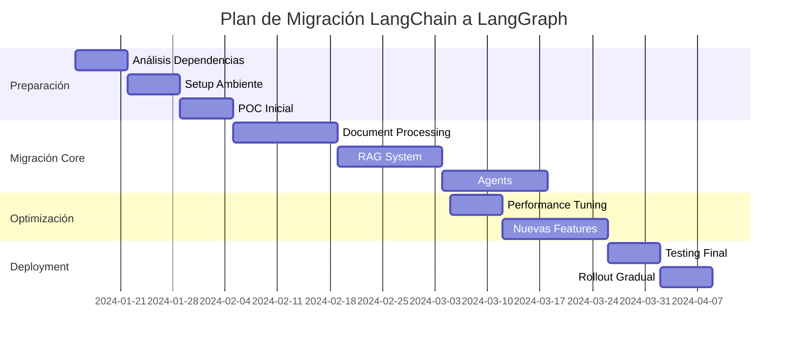

# Estudio de Migración: LangChain a LangGraph

## Resumen Ejecutivo

Este documento analiza la viabilidad y estrategia para migrar el sistema Nexus Document de LangChain a LangGraph, evaluando beneficios, riesgos y plan de implementación.

## 1. Análisis de la Situación Actual

### 1.1 Implementación LangChain Actual

#### Componentes Principales:
- **Microservicio LangChain** (Puerto 8001)
- **Embeddings**: Ollama (nomic-embed-text)
- **LLM**: Ollama (llama3.2)
- **Vector Store**: Qdrant
- **Chains**: RetrievalQA para RAG
- **Document Processing**: Extracción, chunking, indexación

#### Funcionalidades Clave:
1. Procesamiento de documentos (PDF, DOCX, TXT, etc.)
2. Búsqueda semántica
3. RAG (Retrieval-Augmented Generation)
4. Generación de tags y metadatos
5. Recomendaciones de documentos
6. Multi-tenancy con aislamiento de datos

### 1.2 Limitaciones Actuales con LangChain

1. **Flujos Lineales**: Las chains son secuenciales, difíciles de modificar dinámicamente
2. **Sin Estado Persistente**: No hay gestión nativa de estado entre ejecuciones
3. **Debugging Complejo**: Difícil rastrear el flujo de ejecución
4. **Escalabilidad Limitada**: Las chains no soportan ejecución paralela compleja
5. **Sin Ciclos**: No se pueden implementar flujos iterativos fácilmente

## 2. ¿Qué es LangGraph?

LangGraph es una biblioteca construida sobre LangChain que permite crear aplicaciones de IA con:

### 2.1 Características Principales

1. **Grafos con Estado**: Flujos de trabajo como grafos dirigidos con estado persistente
2. **Ciclos y Condicionales**: Soporte nativo para bucles y decisiones complejas
3. **Ejecución Paralela**: Nodos pueden ejecutarse en paralelo
4. **Checkpointing**: Guardar y restaurar estado en cualquier punto
5. **Debugging Mejorado**: Visualización y trazabilidad del grafo
6. **Interrupción Humana**: Pausar para input humano

### 2.2 Ventajas sobre LangChain

| Aspecto | LangChain | LangGraph |
|---------|-----------|-----------|
| Flujos | Lineales | Grafos complejos |
| Estado | Sin estado | Con estado persistente |
| Ciclos | No soportados | Nativos |
| Paralelismo | Limitado | Completo |
| Debugging | Básico | Avanzado con visualización |
| Interrupción | No | Sí, con checkpoints |

## 3. Casos de Uso Mejorados con LangGraph

### 3.1 Procesamiento de Documentos Inteligente

```python
# Ejemplo conceptual con LangGraph
class DocumentProcessingGraph:
    def __init__(self):
        self.graph = StateGraph(DocumentState)
        
        # Nodos
        self.graph.add_node("extract_text", extract_text_node)
        self.graph.add_node("detect_language", detect_language_node)
        self.graph.add_node("chunk_text", chunk_text_node)
        self.graph.add_node("generate_embeddings", embeddings_node)
        self.graph.add_node("quality_check", quality_check_node)
        self.graph.add_node("retry_extraction", retry_extraction_node)
        
        # Edges condicionales
        self.graph.add_conditional_edges(
            "quality_check",
            quality_router,
            {
                "pass": "generate_embeddings",
                "fail": "retry_extraction",
                "manual_review": "human_review"
            }
        )
```

### 3.2 RAG Mejorado con Múltiples Estrategias

```python
class EnhancedRAGGraph:
    def __init__(self):
        self.graph = StateGraph(RAGState)
        
        # Búsqueda paralela en múltiples fuentes
        self.graph.add_node("vector_search", vector_search_node)
        self.graph.add_node("keyword_search", keyword_search_node)
        self.graph.add_node("metadata_search", metadata_search_node)
        
        # Fusión y re-ranking
        self.graph.add_node("fusion", fusion_node)
        self.graph.add_node("rerank", rerank_node)
        
        # Generación con verificación
        self.graph.add_node("generate", generate_node)
        self.graph.add_node("fact_check", fact_check_node)
        self.graph.add_node("refine", refine_node)
```

### 3.3 Agentes Conversacionales con Memoria

```python
class ConversationalAgentGraph:
    def __init__(self):
        self.graph = StateGraph(ConversationState)
        
        # Gestión de contexto
        self.graph.add_node("retrieve_history", retrieve_history_node)
        self.graph.add_node("understand_intent", intent_node)
        self.graph.add_node("route_query", router_node)
        
        # Diferentes tipos de respuesta
        self.graph.add_node("answer_factual", factual_node)
        self.graph.add_node("answer_analytical", analytical_node)
        self.graph.add_node("clarify_question", clarification_node)
```

## 4. Plan de Migración

### 4.1 Fase 1: Preparación (2-3 semanas)

1. **Análisis de Dependencias**
   - Instalar LangGraph manteniendo LangChain
   - Verificar compatibilidad con versiones actuales
   - Crear ambiente de pruebas

2. **Proof of Concept**
   - Migrar un flujo simple (ej: generación de tags)
   - Comparar rendimiento y funcionalidad
   - Validar integración con Qdrant y Ollama

### 4.2 Fase 2: Migración Gradual (4-6 semanas)

#### Semana 1-2: Procesamiento de Documentos
```python
# Migrar de:
chain = load_summarize_chain(llm, chain_type="stuff")

# A:
graph = DocumentProcessingGraph()
result = await graph.ainvoke({"document": doc})
```

#### Semana 3-4: Sistema RAG
- Convertir RetrievalQA a grafo con estados
- Añadir capacidades de re-ranking
- Implementar fallbacks inteligentes

#### Semana 5-6: Features Avanzados
- Agentes conversacionales
- Flujos de trabajo personalizables
- Sistema de recomendaciones mejorado

### 4.3 Fase 3: Optimización (2-3 semanas)

1. **Performance Tuning**
   - Implementar caching con checkpoints
   - Optimizar ejecución paralela
   - Reducir latencia en flujos críticos

2. **Nuevas Capacidades**
   - Editor visual de flujos
   - Sistema de aprobaciones humanas
   - Análisis multi-documento complejo

## 5. Arquitectura Propuesta

### 5.1 Microservicio LangGraph

```yaml
langraph-service:
  build: ./microservices/langraph-service
  ports:
    - "8007:8007"
  environment:
    - LANGGRAPH_BACKEND=sqlite  # Para checkpoints
    - REDIS_URL=redis://redis:6379  # Para estado distribuido
```

### 5.2 Estructura de Grafos

```
/graphs
  /document_processing
    - extraction_graph.py
    - indexing_graph.py
    - quality_graph.py
  /rag
    - retrieval_graph.py
    - generation_graph.py
    - refinement_graph.py
  /agents
    - conversational_graph.py
    - analytical_graph.py
  /workflows
    - approval_workflow.py
    - review_workflow.py
```

### 5.3 API Endpoints Nuevos

```python
# Ejecución de grafos
POST /graph/{graph_name}/run
POST /graph/{graph_name}/stream
GET /graph/{graph_name}/state/{run_id}

# Gestión de checkpoints
POST /checkpoint/save
GET /checkpoint/{checkpoint_id}
POST /checkpoint/{checkpoint_id}/resume

# Visualización
GET /graph/{graph_name}/diagram
GET /graph/{graph_name}/trace/{run_id}
```

## 6. Código de Ejemplo: RAG con LangGraph

```python
from langgraph.graph import StateGraph, END
from typing import TypedDict, List, Dict
import operator

class RAGState(TypedDict):
    query: str
    documents: List[Dict]
    embeddings: List[float]
    search_results: List[Dict]
    generated_answer: str
    confidence_score: float
    needs_refinement: bool

class EnhancedRAGService:
    def __init__(self, vector_store, llm, embeddings):
        self.vector_store = vector_store
        self.llm = llm
        self.embeddings = embeddings
        self.graph = self._build_graph()
    
    def _build_graph(self):
        workflow = StateGraph(RAGState)
        
        # Add nodes
        workflow.add_node("embed_query", self.embed_query)
        workflow.add_node("search_vectors", self.search_vectors)
        workflow.add_node("search_keywords", self.search_keywords)
        workflow.add_node("merge_results", self.merge_results)
        workflow.add_node("generate_answer", self.generate_answer)
        workflow.add_node("check_quality", self.check_quality)
        workflow.add_node("refine_answer", self.refine_answer)
        
        # Define flow
        workflow.set_entry_point("embed_query")
        workflow.add_edge("embed_query", "search_vectors")
        workflow.add_edge("embed_query", "search_keywords")
        workflow.add_edge(["search_vectors", "search_keywords"], "merge_results")
        workflow.add_edge("merge_results", "generate_answer")
        workflow.add_edge("generate_answer", "check_quality")
        
        # Conditional edge
        workflow.add_conditional_edges(
            "check_quality",
            lambda x: "refine" if x["needs_refinement"] else "end",
            {
                "refine": "refine_answer",
                "end": END
            }
        )
        workflow.add_edge("refine_answer", END)
        
        return workflow.compile()
    
    async def process(self, query: str) -> Dict:
        initial_state = {
            "query": query,
            "documents": [],
            "search_results": [],
            "needs_refinement": False
        }
        
        result = await self.graph.ainvoke(initial_state)
        return result
```

## 7. Beneficios Esperados

### 7.1 Funcionales
1. **Flujos Complejos**: Implementar análisis multi-paso con decisiones
2. **Mejor UX**: Respuestas progresivas con streaming
3. **Calidad**: Verificación y refinamiento automático
4. **Personalización**: Flujos adaptables por tenant

### 7.2 Técnicos
1. **Mantenibilidad**: Grafos visualizables y modulares
2. **Debugging**: Trazas completas de ejecución
3. **Performance**: Ejecución paralela optimizada
4. **Escalabilidad**: Estado distribuido con Redis

### 7.3 Negocio
1. **Time to Market**: Nuevos flujos más rápidos de implementar
2. **Confiabilidad**: Mejor manejo de errores con checkpoints
3. **Flexibilidad**: Adaptar flujos sin cambiar código
4. **Diferenciación**: Features únicos como aprobaciones humanas

## 8. Riesgos y Mitigación

### 8.1 Riesgos

| Riesgo | Probabilidad | Impacto | Mitigación |
|--------|-------------|---------|------------|
| Complejidad inicial | Alta | Medio | POC y training del equipo |
| Bugs en migración | Media | Alto | Testing exhaustivo, rollback plan |
| Performance degradado | Baja | Alto | Benchmarks continuos |
| Incompatibilidades | Media | Medio | Ambiente staging completo |

### 8.2 Plan de Rollback

1. Mantener LangChain service funcional
2. Feature flags para cambiar entre servicios
3. Migración por componentes, no big bang
4. Backups de estado y configuraciones

## 9. Métricas de Éxito

### 9.1 Técnicas
- Reducción de latencia en RAG: -20%
- Aumento en throughput: +30%
- Reducción de errores: -40%
- Tiempo de debugging: -50%

### 9.2 Negocio
- Nuevos flujos implementados: +5/mes
- Satisfacción usuario: +15%
- Costos de mantenimiento: -25%
- Features diferenciadores: +3

## 10. Cronograma Propuesto



## 11. Conclusiones

### 11.1 Recomendación

**PROCEDER CON LA MIGRACIÓN** - Los beneficios superan significativamente los riesgos:

1. **Complejidad Manejable**: LangGraph es extensión de LangChain
2. **ROI Claro**: Mejoras en performance y capacidades
3. **Futuro-Proof**: Alineado con dirección de la industria
4. **Diferenciación**: Habilita features únicos

### 11.2 Próximos Pasos

1. **Semana 1**: Aprobar plan y asignar recursos
2. **Semana 2**: Comenzar POC con flujo de tags
3. **Semana 3**: Evaluar resultados y ajustar plan
4. **Semana 4**: Iniciar migración formal

### 11.3 Recursos Necesarios

- 1 Senior Developer (50% dedicación)
- 1 ML Engineer (75% dedicación)
- 1 DevOps (25% dedicación)
- Ambiente de staging adicional
- Presupuesto para training: $2,000

## 12. Referencias

- [LangGraph Documentation](https://python.langchain.com/docs/langgraph)
- [LangGraph Examples](https://github.com/langchain-ai/langgraph/tree/main/examples)
- [Migration Guide](https://python.langchain.com/docs/langgraph/migration)
- [Best Practices](https://python.langchain.com/docs/langgraph/best_practices)

---

**Documento preparado por**: AI Assistant  
**Fecha**: Diciembre 2024  
**Versión**: 1.0  
**Estado**: Para Revisión