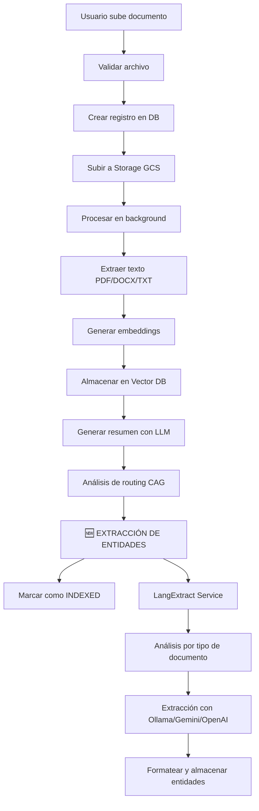

# 🧠 LangExtract Integration - Entity Extraction en Upload de Documentos

## 📋 Resumen

Se ha integrado completamente el **LangExtract microservice** en el flujo de upload de documentos de NexusDocs360. Ahora, cada documento que se sube al sistema automáticamente tiene sus entidades extraídas usando IA especializada.

## 🔄 Nuevo Flujo de Upload Completo



## 🆕 Nuevas Capacidades

### **1. Extracción Automática de Entidades**
- ✅ **Automático**: Cada documento subido extrae entidades
- ✅ **Múltiples tipos**: Contratos, facturas, reportes, general
- ✅ **Multi-provider**: Ollama, Gemini, OpenAI
- ✅ **Almacenamiento**: Campo `extracted_entities` en PostgreSQL

### **2. Tipos de Documentos Soportados**

#### 📋 **Contratos (`contract`, `legal`)**
**Entidades extraídas**:
- Partes involucradas (nombres y roles)
- Tipo y propósito del contrato
- Fechas clave (efectiva, expiración, deadlines)
- Términos de pago e importes
- Obligaciones y entregables
- Cláusulas de terminación
- Ley aplicable y jurisdicción
- Detalles de firmas

#### 💰 **Facturas (`invoice`, `financial`)**
**Entidades extraídas**:
- Número y fecha de factura
- Información del vendedor/comprador
- Elementos de línea con importes
- Subtotal, impuestos y total
- Términos de pago y fecha de vencimiento
- Detalles bancarios/pago

#### 📊 **Reportes (`report`, `compliance`, `technical`)**
**Entidades extraídas**:
- Título y tipo de reporte
- Autores y organización
- Fecha de publicación
- Resumen ejecutivo/abstract
- Hallazgos y conclusiones clave
- Recomendaciones
- Datos estadísticos
- Referencias a otros documentos

#### 📄 **General (`general`, `correspondence`, `hr`)**
**Entidades extraídas**:
- Temas y temas principales
- Entidades importantes (personas, organizaciones, lugares)
- Fechas y referencias temporales
- Valores numéricos e importes
- Hechos y declaraciones clave
- Acciones y obligaciones

## 🛠️ Implementación Técnica

### **1. Servicio de Documentos**
**Archivo**: `app/services/async_document_service.py`

**Nuevo método**: `_extract_entities_langextract()`
```python
async def _extract_entities_langextract(
    text: str, 
    doc_type: str = "general", 
    filename: str = None
) -> Dict[str, Any]
```

**Integración en**: `_process_document_async()` después del routing analysis

### **2. Configuración**
**Variables de entorno**:
```env
LANGEXTRACT_SERVICE_URL=http://langextract-service:8009
MICROSERVICES_API_KEY=your-api-key
```

**Docker Compose**: Servicio `langextract-service` en puerto 8009

### **3. Base de Datos**
**Campo**: `Document.extracted_entities` (JSONB)

**Formato de entidades**:
```json
[
  {
    "name": "TechCorp Inc.",
    "type": "party",
    "role": "Service Provider",
    "context": "company",
    "metadata": {
      "extraction_method": "langextract",
      "provider": "ollama",
      "model": "llama3.2",
      "confidence": 0.9,
      "document_type": "contract"
    }
  }
]
```

## 🔧 Scripts y Herramientas

### **1. Script de Migración**
**Archivo**: `scripts/migrate_extract_entities_langextract.py`

**Uso**:
```bash
cd backend

# Migrar todos los documentos
python scripts/migrate_extract_entities_langextract.py

# Migrar un tenant específico
python scripts/migrate_extract_entities_langextract.py --tenant-id uuid

# Limitar cantidad
python scripts/migrate_extract_entities_langextract.py --limit 50

# Dry run (ver qué se procesaría)
python scripts/migrate_extract_entities_langextract.py --dry-run
```

### **2. Script de Testing**
**Archivo**: `test_langextract_integration.py`

**Uso**:
```bash
cd backend
python test_langextract_integration.py
```

**Tests incluidos**:
- ✅ Test completo de integración (upload → extracción)
- ✅ Test directo del servicio LangExtract
- ✅ Verificación de entidades por tipo
- ✅ Validación de metadatos

## 📊 API Endpoints Existentes

### **1. Búsqueda de Entidades**
```http
GET /api/v1/entities/search/entities?q=TechCorp&types=party,organization
```

### **2. Entidades de Documento**
```http
GET /api/v1/entities/documents/{document_id}/entities
```

### **3. Entidades Recientes**
```http
GET /api/v1/entities/search/entities/recent
```

## 🚀 Cómo Usar

### **Para Desarrolladores**

1. **Iniciar servicios**:
```bash
cd backend/docker
./start-dev.sh
```

2. **Verificar LangExtract service**:
```bash
curl http://localhost:8009/health
```

3. **Subir documento de prueba**:
```bash
# Via API o Frontend - las entidades se extraerán automáticamente
```

4. **Migrar documentos existentes**:
```bash
python scripts/migrate_extract_entities_langextract.py --dry-run
python scripts/migrate_extract_entities_langextract.py --limit 10
```

### **Para Usuarios Finales**

1. **Subir documento**: Usa la interfaz normal de upload
2. **Esperar procesamiento**: Las entidades se extraen automáticamente
3. **Buscar entidades**: Usa la búsqueda de entidades en el frontend
4. **Ver entidades**: En la vista de detalles del documento

## 🔍 Monitoreo y Logs

### **Logs Clave**:
```
🧠 Starting entity extraction for document {doc_id}
📞 Calling LangExtract service at {url}
✅ Entities extracted for {doc_id}: {count} entities found
⚠️ Entity extraction failed for {doc_id}: {error}
```

### **Métricas**:
- Tiempo de extracción por documento
- Número de entidades encontradas por tipo
- Rate de éxito/fallo de extracciones
- Uso de diferentes providers (Ollama/Gemini/OpenAI)

## 🛡️ Manejo de Errores

### **Estrategia de Failover**:
1. **Error en LangExtract**: No falla el upload, se marca `extracted_entities = []`
2. **Timeout**: Se respeta límite de 60s, luego continúa sin entidades
3. **Service unavailable**: Upload continúa, extracción se puede reintentar más tarde

### **Debugging**:
1. **Verificar servicio**: `curl http://langextract-service:8009/health`
2. **Check logs**: `docker logs langextract-service`
3. **Test directo**: `python test_langextract_integration.py`
4. **Revisar DB**: Campo `extracted_entities` en tabla `documents`

## 📈 Rendimiento

### **Optimizaciones**:
- ✅ **Texto limitado**: Máximo 50,000 caracteres por extracción
- ✅ **Procesamiento async**: No bloquea el upload principal
- ✅ **Timeout controlado**: 60 segundos máximo
- ✅ **Mapeo inteligente**: Categorías de documento → tipos LangExtract

### **Tiempos Esperados**:
- **Documento pequeño** (<5k chars): ~5-10 segundos
- **Documento mediano** (5-20k chars): ~15-30 segundos  
- **Documento grande** (20-50k chars): ~30-60 segundos

## 🔮 Futuras Mejoras

### **Próximas Características**:
- 🔄 **Re-extracción bajo demanda**: Botón para re-extraer entidades
- 📊 **Analytics de entidades**: Dashboard con estadísticas
- 🤖 **ML mejoramiento**: Feedback loop para mejorar precisión
- 🔗 **Relaciones entre entidades**: Enlaces y conexiones
- 📱 **Notificaciones**: Alertas cuando se detectan entidades importantes
- 🎯 **Extracción custom**: Templates personalizados por tenant

---

## ✅ **Estado Actual**

**🟢 COMPLETAMENTE IMPLEMENTADO Y FUNCIONAL**

- ✅ Integración en flujo de upload
- ✅ Múltiples tipos de documentos  
- ✅ API de búsqueda existente
- ✅ Scripts de migración y testing
- ✅ Docker compose configurado
- ✅ Manejo robusto de errores
- ✅ Documentación completa

**Próximo**: Testing con documentos reales y optimización de rendimiento.