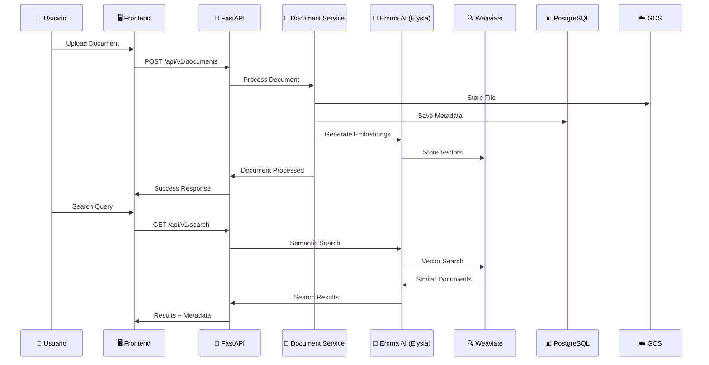
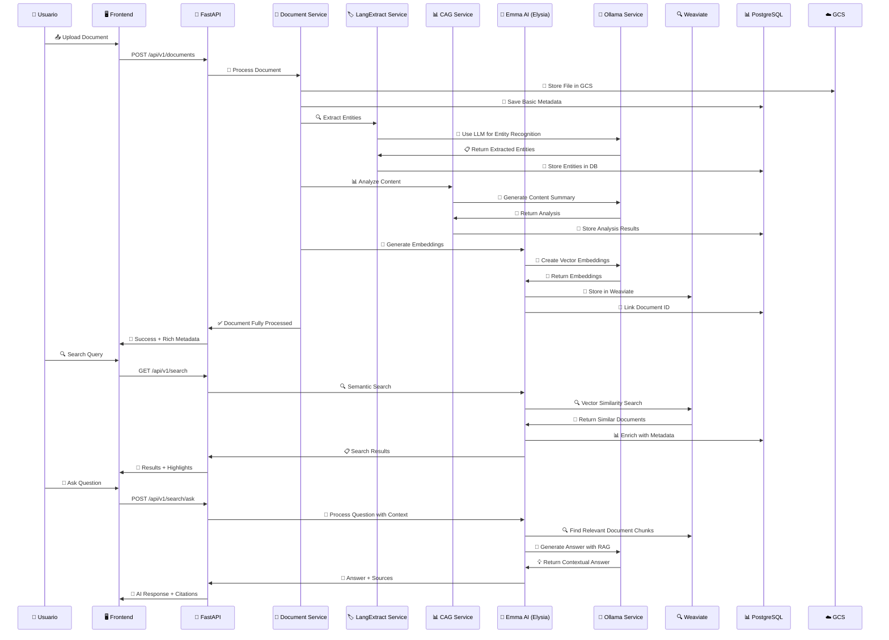
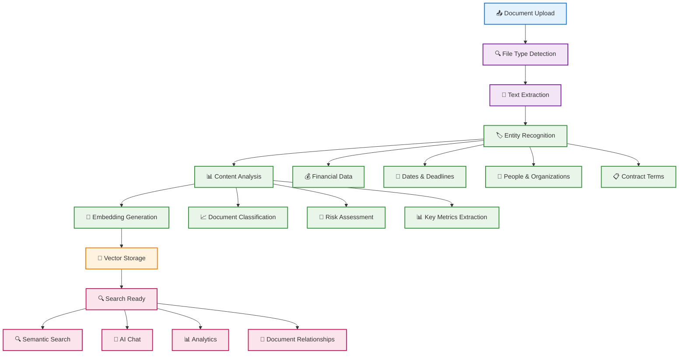
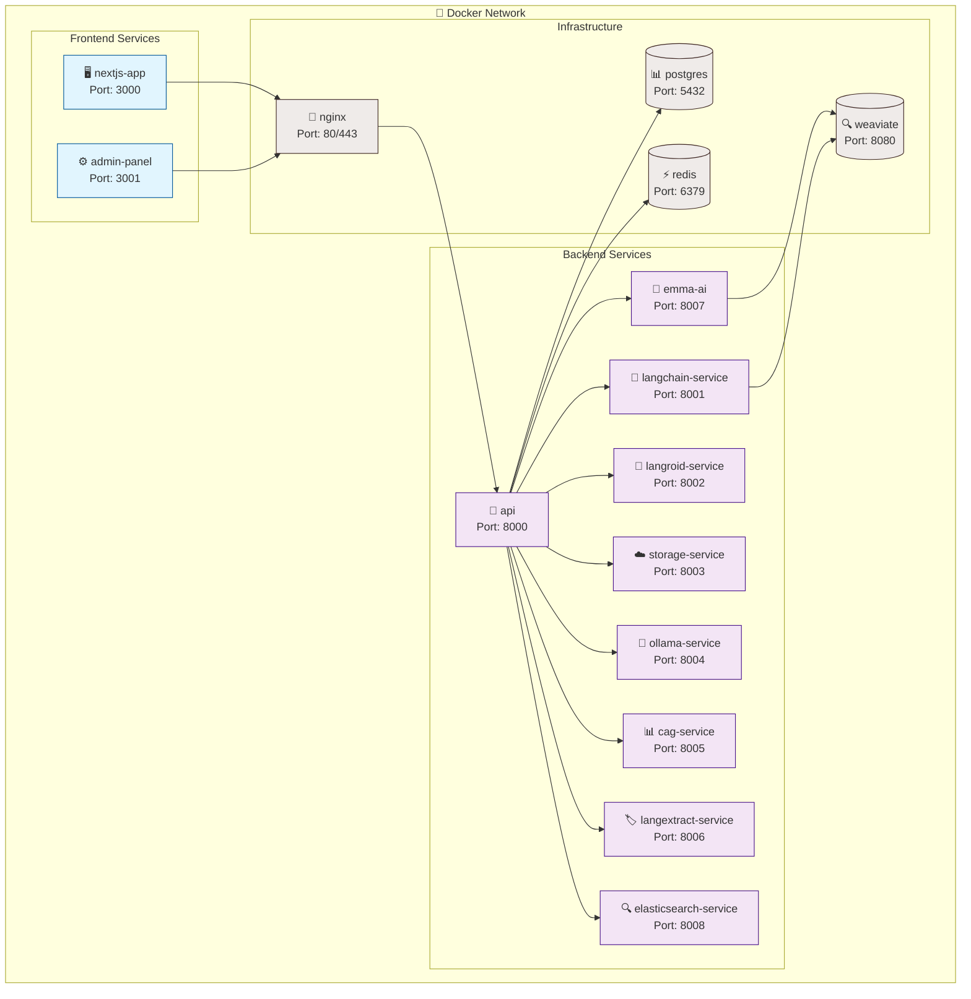

# NexusDocs360 - Plataforma de Gestión Documental Potenciada por IA

<div align="center">
  <h3>🧠 Donde la IA Transforma Documentos en Decisiones 🚀</h3>
  <p><strong>Inteligencia Artificial 360° para tu Gestión Documental</strong></p>
</div>

## 📋 Descripción

**NexusDocs360** es la próxima generación en gestión documental empresarial, donde la Inteligencia Artificial no es solo una característica, sino el núcleo que transforma radicalmente cómo las organizaciones interactúan con su información. Nuestra plataforma utiliza IA avanzada para automatizar el 80% de las tareas documentales, permitiendo que los equipos se enfoquen en decisiones estratégicas mientras la IA maneja la complejidad operativa.

### 🌟 Características Principales Potenciadas por IA

- **🧠 Emma AI Assistant**: Asistente inteligente que comprende contexto, extrae insights y genera respuestas personalizadas
- **🌐 Búsqueda Web en Tiempo Real**: Acceso a información actualizada con herramientas de búsqueda web integradas
- **🔍 Búsqueda Semántica Avanzada**: Powered by Weaviate para encontrar documentos por significado, no solo palabras
- **💬 Chat Conversacional**: Interactúa con tus documentos usando procesamiento de lenguaje natural
- **📊 Análisis Automático**: Extrae automáticamente datos clave de contratos, facturas y documentos legales
- **🧠 Extracción de Entidades**: Sistema LangExtract que identifica automáticamente personas, organizaciones, fechas, importes y relaciones
- **🎯 Clasificación Inteligente**: Organización automática de documentos con IA de alta precisión
- **🔄 Workflows Adaptativos**: Sistema de decisión inteligente que selecciona las mejores herramientas para cada tarea
- **🌐 Capacidades Multimodales**: Procesa texto, PDFs con firmas digitales y metadatos complejos
- **⚖️ Chain of Thought**: Visualización transparente del proceso de razonamiento de la IA (solo para administradores)

## 🤖 Emma AI: Asistente Inteligente de Nueva Generación

### Emma AI Assistant
**Emma** es nuestro asistente de IA avanzado **construido sobre Elysia Framework**, diseñado para proporcionar respuestas contextuales y ejecutar tareas complejas de forma autónoma.

#### Capacidades Principales de Emma:
- **🧠 Procesamiento Contextual**: Comprende el contexto completo de tus documentos
- **🔍 Búsqueda Inteligente**: Encuentra información relevante usando Elysia Framework con Weaviate vector search
- **🌐 Información en Tiempo Real**: Accede a datos actualizados via búsqueda web
- **🌤️ Consultas Meteorológicas**: Información climática para cualquier ubicación
- **📄 Análisis de Documentos**: Extrae insights de contratos, facturas y reportes
- **🏷️ Extracción de Entidades**: Identifica automáticamente personas, organizaciones, fechas e importes
- **🔄 Comparación de Documentos**: Análisis comparativo inteligente entre documentos
- **⚖️ Chain of Thought**: Transparencia completa del proceso de razonamiento (admin)
- **✨ Respuestas Adaptativas**: Sistema de decisión que selecciona las mejores herramientas

#### Tecnología Subyacente:
- **Elysia Framework**: Sistema de decisión inteligente y orquestación de herramientas (core de Emma AI)
- **Weaviate**: Base de datos vectorial para búsqueda semántica avanzada
- **Ollama Integration**: Modelos locales (gpt-oss:20b) para privacidad y rendimiento
- **LangExtract Integration**: Extracción automática de entidades en upload de documentos
- **Multi-Tool Architecture**: 13+ herramientas especializadas para diferentes tareas

### Casos de Uso con IA
1. **Due Diligence Automático**: Analiza 1000+ documentos en minutos con extracción de entidades
2. **Extracción de Datos**: 99% precisión en facturas, contratos, formularios con LangExtract
3. **Generación de Resúmenes**: Dashboards ejecutivos instantáneos
4. **Detección de Anomalías**: Identifica inconsistencias y riesgos ocultos
5. **Comparación de Contratos**: Análisis diferencial automático entre versiones
6. **Búsqueda por Entidades**: Encuentra documentos por personas, organizaciones o importes
7. **Recomendaciones Proactivas**: Sugiere acciones basadas en patrones

## 🏗️ Arquitectura del Sistema

NexusDocs360 está construido con una arquitectura de microservicios moderna y orientada a IA, diseñada para máxima escalabilidad, seguridad y rendimiento.

### 📊 Diagramas de Arquitectura

#### 🎨 **Diagrama Interactivo de Arquitectura**
Para una experiencia visual más detallada, consulta nuestro **[diagrama interactivo de arquitectura](backend/architecture/architecture_diagram.html)** que incluye:
- Vista detallada por capas del sistema
- Flujo de procesamiento de documentos paso a paso
- Conexiones y comunicación entre servicios
- Resumen visual de la arquitectura completa

#### 📈 **Diagrama General del Sistema**

```mermaid
graph TB
    %% Usuarios y Dispositivos
    subgraph "👥 Usuarios"
        User[👤 Usuario Final]
        Admin[👑 Administrador]
        API_Client[🤖 API Client]
    end

    %% Capa de Presentación
    subgraph "🎨 Frontend Layer"
        NextJS[🖥️ Next.js 15<br/>App Router + TypeScript]
        Mobile[📱 Mobile App<br/>React Native]
        AdminUI[⚙️ Admin Dashboard<br/>Shadcn/UI]
    end

    %% API Gateway y Autenticación
    subgraph "🌐 API Gateway"
        Nginx[🔀 Nginx Proxy<br/>SSL + Load Balancer]
        Clerk[🔐 Clerk Auth<br/>OAuth2 + JWT]
        FastAPI[🚀 FastAPI<br/>Main API Gateway]
    end

    %% Servicios de Negocio
    subgraph "⚙️ Business Services"
        DocumentSvc[📄 Document Service<br/>Upload + Processing]
        SearchSvc[🔍 Search Service<br/>Semantic + Hybrid]
        AgentSvc[🤖 Agent Service<br/>AI Conversations]
        SignatureSvc[✍️ Signature Service<br/>Digital Signatures]
        StorageSvc[☁️ Storage Service<br/>GCS Integration]
        AuthSvc[🔒 Auth Service<br/>RBAC + Multi-tenant]
        TeamSvc[👥 Team Service<br/>Collaboration]
        NotificationSvc[📧 Notification Service<br/>Email + Webhooks]
    end

    %% Microservicios de IA
    subgraph "🧠 AI Microservices"
        EmmaAI[🤖 Emma AI Service<br/>Elysia Framework + Weaviate<br/>Port: 8007]
        LangChainSvc[🔗 LangChain Service<br/>LLM Processing<br/>Port: 8001]
        LangroidSvc[🎯 Langroid Service<br/>Multi-agent<br/>Port: 8002]
        OllamaSvc[🦙 Ollama Service<br/>Local LLMs<br/>Port: 8004]
        CAG_Svc[📊 CAG Service<br/>Content Analysis<br/>Port: 8005]
        LangExtractSvc[🏷️ LangExtract Service<br/>Entity Extraction<br/>Port: 8006]
    end

    %% Capa de Datos
    subgraph "💾 Data Layer"
        PostgreSQL[(📊 PostgreSQL 15<br/>Main Database<br/>Multi-tenant)]
        Weaviate[(🔍 Weaviate<br/>Vector Database<br/>Semantic Search)]
        Redis[(⚡ Redis<br/>Cache + Sessions)]
        Elasticsearch[(🔎 Elasticsearch<br/>Hybrid Search<br/>Microservice)]
    end

    %% Servicios Externos
    subgraph "🌍 External Services"
        GCS[☁️ Google Cloud Storage<br/>File Storage]
        Stripe[💳 Stripe<br/>Payments]
        SignatureProviders[✍️ Signature Providers<br/>DocuSign, YouSign, etc.]
        EmailSvc[📧 Email Service<br/>SendGrid/Mailgun]
        WebSearch[🌐 Web Search APIs<br/>DuckDuckGo, etc.]
        WeatherAPI[🌤️ Weather APIs<br/>Current conditions]
    end

    %% Conexiones
    User --> NextJS
    Admin --> AdminUI
    API_Client --> Nginx

    NextJS --> Clerk
    AdminUI --> Clerk
    Mobile --> Clerk

    Clerk --> FastAPI
    Nginx --> FastAPI

    FastAPI --> DocumentSvc
    FastAPI --> SearchSvc
    FastAPI --> AgentSvc
    FastAPI --> SignatureSvc
    FastAPI --> StorageSvc
    FastAPI --> AuthSvc
    FastAPI --> TeamSvc
    FastAPI --> NotificationSvc

    DocumentSvc --> LangExtractSvc
    SearchSvc --> EmmaAI
    AgentSvc --> EmmaAI
    EmmaAI --> LangChainSvc
    EmmaAI --> LangroidSvc
    EmmaAI --> OllamaSvc

    DocumentSvc --> CAG_Svc
    CAG_Svc --> OllamaSvc

    DocumentSvc --> PostgreSQL
    SearchSvc --> PostgreSQL
    AgentSvc --> PostgreSQL
    AuthSvc --> PostgreSQL
    TeamSvc --> PostgreSQL

    EmmaAI --> Weaviate
    LangChainSvc --> Weaviate
    SearchSvc --> Weaviate

    DocumentSvc --> Redis
    SearchSvc --> Redis
    AuthSvc --> Redis

    SearchSvc --> Elasticsearch

    StorageSvc --> GCS
    SignatureSvc --> SignatureProviders
    NotificationSvc --> EmailSvc

    EmmaAI --> WebSearch
    EmmaAI --> WeatherAPI

    FastAPI --> Stripe

    %% Estilos
    classDef frontend fill:#e1f5fe,stroke:#01579b,stroke-width:2px
    classDef api fill:#f3e5f5,stroke:#4a148c,stroke-width:2px
    classDef service fill:#e8f5e8,stroke:#1b5e20,stroke-width:2px
    classDef microservice fill:#fff3e0,stroke:#e65100,stroke-width:2px
    classDef database fill:#fce4ec,stroke:#880e4f,stroke-width:2px
    classDef external fill:#efebe9,stroke:#3e2723,stroke-width:2px

    class NextJS,Mobile,AdminUI frontend
    class Nginx,Clerk,FastAPI api
    class DocumentSvc,SearchSvc,AgentSvc,SignatureSvc,StorageSvc,AuthSvc,TeamSvc,NotificationSvc service
    class EmmaAI,LangChainSvc,LangroidSvc,OllamaSvc,CAG_Svc,LangExtractSvc microservice
    class PostgreSQL,Weaviate,Redis,Elasticsearch database
    class GCS,Stripe,SignatureProviders,EmailSvc,WebSearch,WeatherAPI external
```



### 🏛️ Arquitectura por Capas

#### 🎨 **Capa de Presentación**
- **Next.js 15**: Framework React moderno con App Router
- **Shadcn/UI**: Componentes accesibles y personalizables
- **TypeScript**: Type safety completo en el frontend
- **Tailwind CSS**: Diseño responsive y moderno
- **PWA Support**: Funcionalidad offline y notificaciones

#### 🌐 **Capa de API Gateway**
- **Nginx**: Proxy reverso con SSL automático y load balancing
- **Clerk**: Autenticación OAuth2/JWT multi-proveedor
- **FastAPI**: API principal con documentación automática
- **Rate Limiting**: Protección contra abuso de APIs
- **CORS**: Configuración segura para desarrollo y producción

#### ⚙️ **Servicios de Negocio (Core)**
- **Document Service**: Gestión completa del ciclo de vida de documentos
- **Search Service**: Búsqueda híbrida (semántica + keyword)
- **Agent Service**: Gestión de conversaciones con IA
- **Signature Service**: Integración con proveedores de firma digital
- **Storage Service**: Gestión de archivos en Google Cloud Storage
- **Auth Service**: Autenticación y autorización multi-tenant
- **Team Service**: Colaboración y gestión de equipos
- **Notification Service**: Sistema de notificaciones y webhooks

#### 🧠 **Microservicios de IA**
- **Emma AI Service** (Port 8007): Asistente inteligente con Elysia Framework + Weaviate
- **LangChain Service** (Port 8001): Procesamiento avanzado con LLMs
- **Langroid Service** (Port 8002): Arquitectura multi-agente
- **Ollama Service** (Port 8004): Modelos LLM locales (Llama 3.1, GPT-OSS)
- **CAG Service** (Port 8005): Análisis de contenido y metadatos
- **LangExtract Service** (Port 8006): Extracción automática de entidades
- **Elasticsearch Service** (Port 8008): Búsqueda híbrida y analytics

#### 💾 **Capa de Datos**
- **PostgreSQL 15**: Base de datos relacional multi-tenant
- **Weaviate**: Base de datos vectorial para búsqueda semántica
- **Redis**: Cache de alto rendimiento y gestión de sesiones
- **Elasticsearch**: Búsqueda híbrida y analytics (microservicio)

#### 🌍 **Servicios Externos**
- **Google Cloud Storage**: Almacenamiento seguro y escalable
- **Stripe**: Procesamiento de pagos y suscripciones
- **Signature Providers**: DocuSign, YouSign, Signaturit
- **Email Services**: SendGrid, Mailgun para notificaciones
- **Web Search APIs**: Información en tiempo real
- **Weather APIs**: Datos meteorológicos contextuales

### 🔄 **Flujo de Datos Principal**



### 🛡️ **Características de Seguridad**

- **🔐 Autenticación Multi-Factor**: Clerk con soporte OAuth2
- **👥 Aislamiento Multi-Tenant**: Datos completamente separados
- **🔒 Encriptación End-to-End**: Datos en reposo y tránsito
- **📊 Auditoría Completa**: Logging de todas las operaciones
- **🚫 Rate Limiting**: Protección contra ataques DoS
- **🔑 RBAC**: Control granular de permisos
- **🛡️ CORS**: Configuración segura por entorno

### 📈 **Escalabilidad y Rendimiento**

- **🐳 Docker**: Contenerización completa con hot-reload
- **⚡ Async/Await**: Procesamiento asíncrono en Python
- **🔄 Load Balancing**: Distribución automática de carga
- **📊 Monitoring**: Métricas en tiempo real con Prometheus
- **🚀 CDN**: Optimización de assets estáticos
- **💾 Cache**: Redis para mejorar rendimiento
- **🔍 Vector Search**: Búsqueda semántica de alta velocidad

### 📊 Flujo de Procesamiento de Documentos con IA



### 🔄 **Pipeline de IA Completo**



### 🔌 **APIs y Puertos del Sistema**

| Servicio | Puerto | Tecnología | Endpoint Principal | Descripción |
|----------|--------|------------|-------------------|-------------|
| **Main API** | `8000` | FastAPI | `/api/v1/` | API principal del sistema |
| **Emma AI** | `8007` | FastAPI + Elysia + Weaviate | `/elysia/` | Asistente inteligente con Elysia Framework |
| **LangChain** | `8001` | FastAPI + LangChain | `/langchain/` | Procesamiento LLM |
| **Langroid** | `8002` | FastAPI + Langroid | `/langroid/` | Multi-agente |
| **Storage** | `8003` | FastAPI | `/storage/` | Google Cloud Storage |
| **Ollama** | `8004` | FastAPI | `/ollama/` | Modelos LLM locales |
| **CAG** | `8005` | FastAPI | `/cag/` | Análisis de contenido |
| **LangExtract** | `8006` | FastAPI | `/langextract/` | Extracción de entidades |
| **Elasticsearch** | `8008` | FastAPI | `/api/v1/elasticsearch/` | Búsqueda híbrida |
| **Frontend** | `3000` | Next.js | `/` | Interfaz de usuario |
| **Admin** | `3001` | Next.js | `/admin` | Panel de administración |

### 🐳 **Arquitectura Docker**

### 📚 **Documentación de Arquitectura Adicional**

Para diagramas más detallados y específicos:

- **[Diagrama Interactivo HTML](backend/architecture/architecture_diagram.html)** - Vista completa e interactiva de la arquitectura
- **[Sistema General](backend/architecture/system-overview.md)** - Diagrama general del sistema
- **[Flujo de Datos](backend/architecture/data-flow.md)** - Secuencia de procesamiento de datos
- **[Procesamiento de Documentos](backend/architecture/document-processing.md)** - Pipeline completo de IA
- **[Pipeline de IA](backend/architecture/ai-pipeline.md)** - Arquitectura del procesamiento con IA
- **[Arquitectura Docker](backend/architecture/docker-architecture.md)** - Configuración de contenedores

### 🔄 **Arquitectura Docker**



## 🚀 Inicio Rápido

### Prerrequisitos
- Docker y Docker Compose
- Node.js 18+ (para desarrollo frontend)
- Python 3.9+ (para desarrollo backend)
- Cuenta en Google Cloud (para almacenamiento)

### Instalación

1. **Clonar el repositorio**:
```bash
git clone https://github.com/your-org/nexusdocs360.git
cd nexusdocs360
```

2. **Configurar variables de entorno**:
```bash
cp .env.example .env
# Editar .env con tu configuración
```

3. **Iniciar servicios con Docker**:
```bash
# Backend + Servicios
cd backend/docker
./start-dev.sh

# Frontend (en otra terminal)
cd frontend
npm install
npm run dev
```

4. **Acceder a la aplicación**:
- Frontend: http://localhost:3000
- API Docs: http://localhost:8000/docs
- Administración: http://localhost:3000/admin

## 🔧 Desarrollo

### Estructura del Proyecto
```
nexusdocs360/
├── backend/
│   ├── app/               # Aplicación principal FastAPI
│   ├── microservices/     # Microservicios especializados
│   ├── docker/            # Configuración Docker
│   └── tests/             # Tests automatizados
├── frontend/
│   ├── app/               # Next.js App Router
│   ├── components/        # Componentes React
│   └── lib/               # Utilidades y servicios
├── nginx/                 # Configuración proxy reverso
└── deployment/           # Scripts de despliegue
```

### Comandos Útiles

```bash
# Backend
cd backend/docker && ./start-dev.sh     # Iniciar desarrollo
cd backend/tests && ./run_tests.sh      # Ejecutar tests

# Frontend
cd frontend && npm run dev               # Iniciar desarrollo
cd frontend && npm run build             # Build producción
cd frontend && npm run lint              # Linting

# Base de datos
cd backend && python scripts/alembic_safe_migrate.py  # Migraciones seguras
cd backend && python -m scripts.init_db               # Inicializar DB

# 🆕 Extracción de Entidades
cd backend && python scripts/migrate_extract_entities_langextract.py --dry-run  # Migrar documentos existentes
```

## 📦 Despliegue

### Google Cloud Platform (Recomendado)

```bash
# Configuración rápida
./deploy-to-gcp.sh

# O paso a paso
cd deployment/gcp
cp .env.prod .env
./setup-secrets.sh
./deploy-infrastructure.sh
gcloud builds submit --config=cloudbuild.yaml
```

Consulta [DEPLOYMENT.md](DEPLOYMENT.md) para guía completa de despliegue.

## 📚 Documentación Adicional

- **[LANGEXTRACT_INTEGRATION.md](LANGEXTRACT_INTEGRATION.md)**: Guía completa de extracción automática de entidades
- **[EMMA_ARCHITECTURE.md](EMMA_ARCHITECTURE.md)**: Arquitectura técnica de Emma AI y Chain of Thought
- **[CLAUDE.md](CLAUDE.md)**: Guía para desarrollo con Claude Code

## 🔐 Seguridad

- Autenticación multi-factor con Clerk
- Encriptación en reposo y tránsito
- Auditoría completa de acciones
- Cumplimiento GDPR/HIPAA ready
- Aislamiento total multi-tenant

## 🆕 Últimas Mejoras y Características

### 🧠 Extracción Automática de Entidades (NUEVO)
**Integración completa de LangExtract en el flujo de upload**:
- ✅ **Automático**: Cada documento extrae entidades al subir
- ✅ **Múltiples tipos**: Contratos, facturas, reportes, documentos generales  
- ✅ **Entidades detectadas**: Personas, organizaciones, fechas, importes, términos legales
- ✅ **API de búsqueda**: Búsqueda por entidades extraídas
- ✅ **Migración**: Script para extraer entidades de documentos existentes

### ⚖️ Chain of Thought Visualization (NUEVO)
**Para administradores del sistema**:
- ✅ **Transparencia total**: Visualiza el proceso de razonamiento de Emma AI
- ✅ **Decision Tree**: Árbol de decisiones con contexto global
- ✅ **Tool Selection**: Ve qué herramientas considera y selecciona
- ✅ **Reasoning Steps**: Pasos detallados del análisis
- ✅ **Performance Metrics**: Tiempo de ejecución y confianza

### 🔄 Comparación de Documentos (NUEVO)
**Emma AI puede comparar documentos**:
- ✅ **Análisis de contenido**: Similitudes y diferencias
- ✅ **Comparación estructural**: Formato y organización
- ✅ **Metadatos**: Fechas, autores, versiones
- ✅ **Recomendaciones**: Acciones sugeridas basadas en diferencias

## 📊 Características Empresariales

- **Gestión de Equipos**: Roles y permisos granulares
- **Integraciones**: API REST, Webhooks, SDK
- **Personalización**: Campos personalizados, workflows
- **Escalabilidad**: Arquitectura cloud-native
- **Soporte 24/7**: SLA empresarial disponible

## 🤝 Contribuir

Las contribuciones son bienvenidas. Por favor:

1. Fork el proyecto
2. Crea tu feature branch (`git checkout -b feature/AmazingFeature`)
3. Commit tus cambios (`git commit -m 'Add AmazingFeature'`)
4. Push al branch (`git push origin feature/AmazingFeature`)
5. Abre un Pull Request

## 📄 Licencia

Este proyecto está licenciado bajo [MIT License](LICENSE).

## 🆘 Soporte

- 📧 Email: support@nexusdocs360.com
- 📚 Documentación: [docs.nexusdocs360.com](https://docs.nexusdocs360.com)
- 💬 Discord: [NexusDocs360 Community](https://discord.gg/nexusdocs360)
- 🐛 Issues: [GitHub Issues](https://github.com/your-org/nexusdocs360/issues)

---

<div align="center">
  <h3>🧠 NexusDocs360 - Donde la Inteligencia Artificial Transforma Cada Documento en Ventaja Competitiva 🚀</h3>
  <p><strong>El Futuro de la Gestión Documental es Inteligente</strong></p>
  <p>Potenciado por IA de Vanguardia | Hecho con ❤️ y 🤖 por el equipo de NexusDocs360</p>
</div>