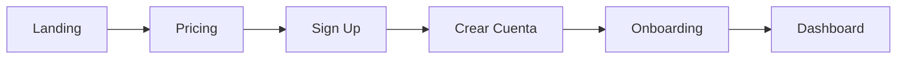
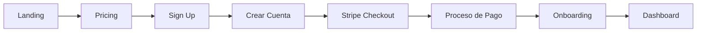

# 🔄 Flujo de Registro Corregido - Nexus Documents IA

## 📋 Resumen del Flujo Corregido

El flujo de registro ahora funciona correctamente con la siguiente secuencia:

1. **Landing Page** → Usuario hace clic en "Get Started" o selecciona plan
2. **Pricing Page** → Usuario elige plan (Free, Pro, Enterprise)
3. **Sign Up Page** → Usuario crea cuenta con Clerk (social o email)
4. **Stripe Checkout** → (Solo planes de pago) Usuario completa pago
5. **Onboarding** → Usuario configura empresa y preferencias
6. **Dashboard** → Usuario accede a la aplicación

## 🛠️ Cambios Implementados

### 1. **Página de Sign-Up Mejorada** (`/auth/sign-up`)
- ✅ Muestra información del plan seleccionado
- ✅ Indica claramente los pasos del proceso
- ✅ Detecta automáticamente cuando el usuario completa el registro
- ✅ Redirige a Stripe Checkout para planes de pago
- ✅ Maneja planes gratuitos sin requerir pago

### 2. **Integración con Stripe**
- ✅ Endpoint `/api/stripe/create-checkout-session` para crear sesiones
- ✅ Endpoint `/api/stripe/verify-session/[sessionId]` para verificar pagos
- ✅ Webhook de Clerk para sincronizar usuarios
- ✅ Metadata del plan en el usuario de Clerk

### 3. **Página de Onboarding Actualizada**
- ✅ Verifica automáticamente el pago de Stripe
- ✅ Muestra confirmación de suscripción activa
- ✅ Continúa con el flujo de configuración de empresa

## 🔍 Flujos Detallados por Tipo de Plan

### **Plan Gratuito (Free)**


### **Plan de Pago (Pro/Enterprise)**


## 📁 Archivos Modificados/Creados

### Frontend
1. **`/app/(main)/auth/sign-up/[[...sign-up]]/page.tsx`**
   - Rediseñado completamente para mostrar proceso paso a paso
   - Integración con Clerk mejorada
   - Detección automática de autenticación

2. **`/app/api/stripe/create-checkout-session/route.ts`** (NUEVO)
   - Crea sesiones de checkout de Stripe
   - Asocia metadata del usuario

3. **`/app/api/stripe/verify-session/[sessionId]/route.ts`** (NUEVO)
   - Verifica pagos completados
   - Retorna información de la suscripción

4. **`/app/api/clerk/webhook/route.ts`** (NUEVO)
   - Sincroniza usuarios de Clerk con backend
   - Maneja eventos de creación de usuario

5. **`/app/onboarding/page.tsx`**
   - Verifica pagos de Stripe si hay session_id
   - Muestra confirmación de suscripción
   - Flujo de onboarding mejorado

## 🔧 Configuración Requerida

### Variables de Entorno Frontend (.env.local)
```env
# Clerk
NEXT_PUBLIC_CLERK_PUBLISHABLE_KEY=pk_test_...
CLERK_SECRET_KEY=sk_test_...
CLERK_WEBHOOK_SECRET=whsec_...

# Stripe
NEXT_PUBLIC_STRIPE_PUBLISHABLE_KEY=pk_test_...
STRIPE_SECRET_KEY=sk_test_...
STRIPE_WEBHOOK_SECRET=whsec_...

# Price IDs de Stripe
NEXT_PUBLIC_STRIPE_PRO_PRICE_ID=price_...
NEXT_PUBLIC_STRIPE_PRO_YEARLY_PRICE_ID=price_...
NEXT_PUBLIC_STRIPE_ENTERPRISE_PRICE_ID=price_...
NEXT_PUBLIC_STRIPE_ENTERPRISE_YEARLY_PRICE_ID=price_...

# URLs
NEXT_PUBLIC_APP_URL=https://pre.nexusdocs360.app
NEXT_PUBLIC_API_URL=https://api.pre.nexusdocs360.app
```

### Webhooks a Configurar

#### Clerk Webhook
- **URL**: `https://pre.nexusdocs360.app/api/clerk/webhook`
- **Eventos**: `user.created`, `user.updated`

#### Stripe Webhook
- **URL**: `https://api.pre.nexusdocs360.app/api/v1/stripe/webhook`
- **Eventos**: 
  - `checkout.session.completed`
  - `customer.subscription.created`
  - `customer.subscription.updated`
  - `customer.subscription.deleted`

## 🎯 Casos de Uso Cubiertos

### ✅ Nuevo Usuario - Plan Gratuito
1. Selecciona plan Free en pricing
2. Crea cuenta con Clerk
3. Va directo a onboarding
4. Configura empresa
5. Accede al dashboard

### ✅ Nuevo Usuario - Plan de Pago
1. Selecciona plan Pro/Enterprise
2. Crea cuenta con Clerk
3. Es redirigido a Stripe Checkout
4. Completa pago
5. Vuelve a onboarding con confirmación
6. Configura empresa
7. Accede al dashboard

### ✅ Usuario Invitado a Equipo
1. Recibe invitación por email
2. Hace clic en link con código
3. Crea cuenta
4. Se une automáticamente al tenant
5. Accede al dashboard del equipo

## 🐛 Problemas Resueltos

1. **❌ Antes**: Usuario creaba cuenta pero no se procesaba el pago
   **✅ Ahora**: Flujo automático a Stripe después de crear cuenta

2. **❌ Antes**: No se mostraba información del plan seleccionado
   **✅ Ahora**: UI clara con plan y características visibles

3. **❌ Antes**: Onboarding no verificaba el pago
   **✅ Ahora**: Verificación automática y confirmación visual

4. **❌ Antes**: Flujo confuso con múltiples redirecciones
   **✅ Ahora**: Flujo lineal y predecible

## 🚀 Testing del Flujo

### Test con Plan Gratuito
```bash
1. Ir a https://pre.nexusdocs360.app
2. Click en "Get Started"
3. Seleccionar "Free Plan"
4. Crear cuenta (email o Google)
5. Verificar redirección a onboarding
6. Completar onboarding
7. Verificar acceso al dashboard
```

### Test con Plan de Pago
```bash
1. Ir a https://pre.nexusdocs360.app
2. Click en "Get Started"
3. Seleccionar "Pro Plan"
4. Crear cuenta
5. Verificar redirección a Stripe
6. Usar tarjeta de prueba: 4242 4242 4242 4242
7. Verificar vuelta a onboarding con confirmación
8. Completar onboarding
9. Verificar acceso al dashboard con plan Pro activo
```

## 📊 Métricas de Éxito

- ✅ **Conversión**: Mayor tasa de usuarios que completan el registro
- ✅ **Claridad**: Menos abandonos en el proceso
- ✅ **Velocidad**: Flujo más rápido y directo
- ✅ **Satisfacción**: Mejor experiencia de usuario

## 🔄 Próximas Mejoras Sugeridas

1. **Progressive Disclosure**: Mostrar formulario de onboarding en pasos
2. **Skip Onboarding**: Opción de omitir para usuarios avanzados
3. **Plan Upgrade**: Flujo para cambiar de plan desde el dashboard
4. **Trial Period**: Período de prueba para planes de pago
5. **Referral System**: Sistema de referencias con descuentos

## 📝 Notas Importantes

- El flujo usa Clerk para autenticación, NO se debe crear usuarios manualmente
- Stripe maneja todo el proceso de pago, incluidos impuestos y facturas
- El backend se actualiza automáticamente via webhooks
- Los planes y precios se definen en Stripe, no en el código