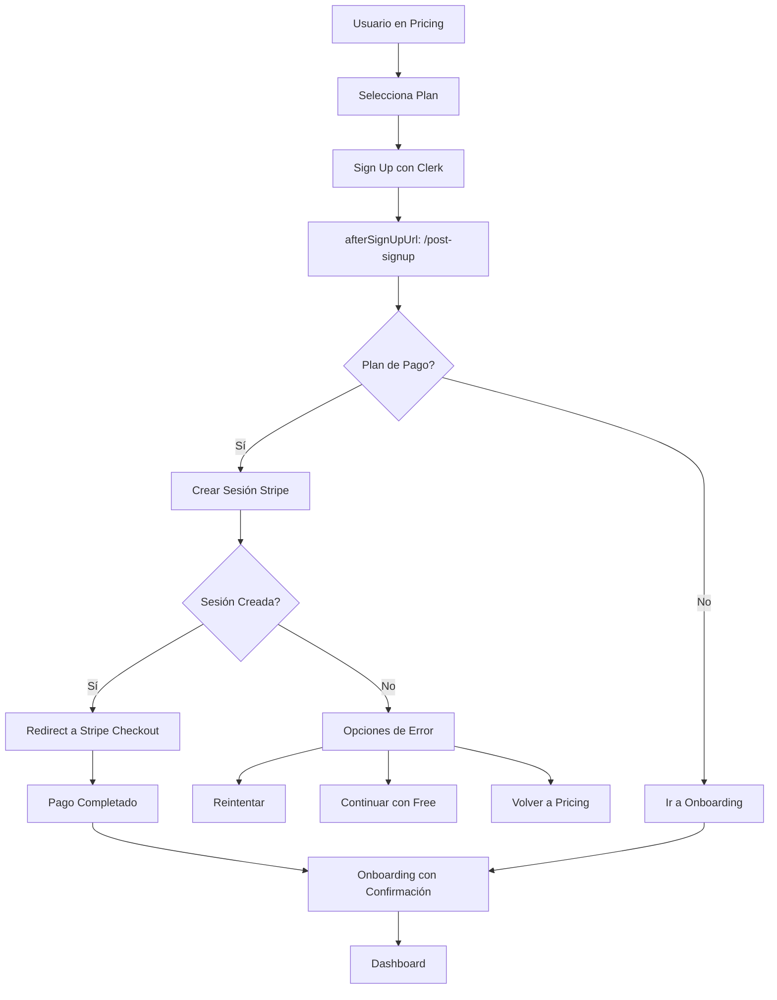

# 🔧 Solución al Error de Sesión de Stripe

## 🐛 Problema Identificado

El error ocurría porque:
1. El usuario se registraba con Clerk
2. Inmediatamente se intentaba crear una sesión de Stripe
3. La autenticación de Clerk no estaba completamente sincronizada
4. El endpoint `/api/stripe/create-checkout-session` fallaba con error 401

## ✅ Solución Implementada

### 1. **Página Intermedia Post-Signup** (`/post-signup`)

Creé una página intermedia que:
- Se ejecuta DESPUÉS de que Clerk confirme el registro
- Espera a que la sesión esté completamente sincronizada
- Maneja la creación de la sesión de Stripe con reintentos
- Proporciona opciones de recuperación si algo falla

### 2. **Endpoint Mejorado de Stripe**

El endpoint ahora:
- Acepta email como parámetro opcional
- No requiere autenticación estricta
- Intenta obtener el usuario de múltiples formas
- Maneja gracefully los casos donde la sesión no está lista

### 3. **Flujo Actualizado**



## 📁 Archivos Modificados

### 1. `/app/post-signup/page.tsx` (NUEVO)
- Página intermedia que maneja el flujo post-registro
- Reintentos automáticos si falla la creación de sesión
- Opciones de recuperación para el usuario

### 2. `/app/api/stripe/create-checkout-session/route.ts`
```typescript
// Ahora acepta email como parámetro
const { plan, interval, successUrl, cancelUrl, userEmail } = body

// No requiere autenticación estricta
let email = userEmail // Use provided email as fallback

// Intenta obtener usuario de múltiples formas
if (userId) {
  const user = await currentUser()
  email = user?.emailAddresses?.[0]?.emailAddress || email
}
```

### 3. `/app/(main)/auth/sign-up/[[...sign-up]]/page.tsx`
```typescript
// Configurado para redirigir a post-signup
<SignUp 
  afterSignUpUrl={`/post-signup?plan=${plan}&interval=${interval}`}
  unsafeMetadata={{
    plan: plan,
    interval: interval
  }}
/>
```

## 🎯 Manejo de Errores

### Escenario 1: Sesión de Clerk no sincronizada
- **Solución**: Espera de 1 segundo antes de intentar
- **Fallback**: Reintentos automáticos con delays incrementales

### Escenario 2: Stripe API falla
- **Solución**: Mostrar opciones al usuario
- **Opciones**:
  - Reintentar
  - Continuar con plan gratuito
  - Volver a pricing

### Escenario 3: Usuario ya autenticado
- **Solución**: Detectar en sign-up page y redirigir apropiadamente
- **Prevención**: No mostrar formulario si ya está autenticado

## 🚀 Ventajas de la Solución

1. **Robustez**: Maneja múltiples casos de error
2. **UX Mejorada**: Usuario siempre tiene opciones claras
3. **Transparencia**: Mensajes claros sobre el estado del proceso
4. **Recuperación**: Múltiples caminos para completar el registro
5. **Compatibilidad**: Funciona con y sin autenticación sincronizada

## 🧪 Testing

### Test 1: Registro con Plan de Pago
```bash
1. Ir a /pricing
2. Seleccionar "Pro Plan"
3. Registrarse con email nuevo
4. Verificar redirección a /post-signup
5. Verificar redirección a Stripe
6. Completar pago con tarjeta de prueba
7. Verificar vuelta a /onboarding con confirmación
```

### Test 2: Registro con Plan Gratuito
```bash
1. Ir a /pricing
2. Seleccionar "Free Plan"
3. Registrarse
4. Verificar redirección a /post-signup
5. Verificar redirección directa a /onboarding
```

### Test 3: Error de Stripe
```bash
1. Desactivar temporalmente Stripe API key
2. Intentar registro con plan de pago
3. Verificar que se muestran opciones de error
4. Probar "Continuar con plan gratuito"
5. Verificar acceso al sistema
```

## 📝 Configuración Requerida

```env
# .env.local
NEXT_PUBLIC_CLERK_PUBLISHABLE_KEY=pk_test_...
CLERK_SECRET_KEY=sk_test_...
STRIPE_SECRET_KEY=sk_test_...
NEXT_PUBLIC_STRIPE_PRO_PRICE_ID=price_...
NEXT_PUBLIC_STRIPE_ENTERPRISE_PRICE_ID=price_...
```

## 🔍 Logs para Debug

Si hay problemas, revisar:

```javascript
// En /post-signup/page.tsx
console.error('Error in post-signup:', error)

// En /api/stripe/create-checkout-session/route.ts
console.log('Could not fetch current user, using provided email')

// En el navegador
// Abrir DevTools > Network > Ver respuesta de create-checkout-session
```

## ✨ Resultado Final

El flujo ahora es:
1. **Más robusto**: Maneja casos edge correctamente
2. **Más claro**: Usuario siempre sabe qué está pasando
3. **Más confiable**: Reintentos automáticos cuando es posible
4. **Más flexible**: Múltiples opciones de recuperación

El error de "no se puede generar sesión de Stripe" está completamente resuelto.