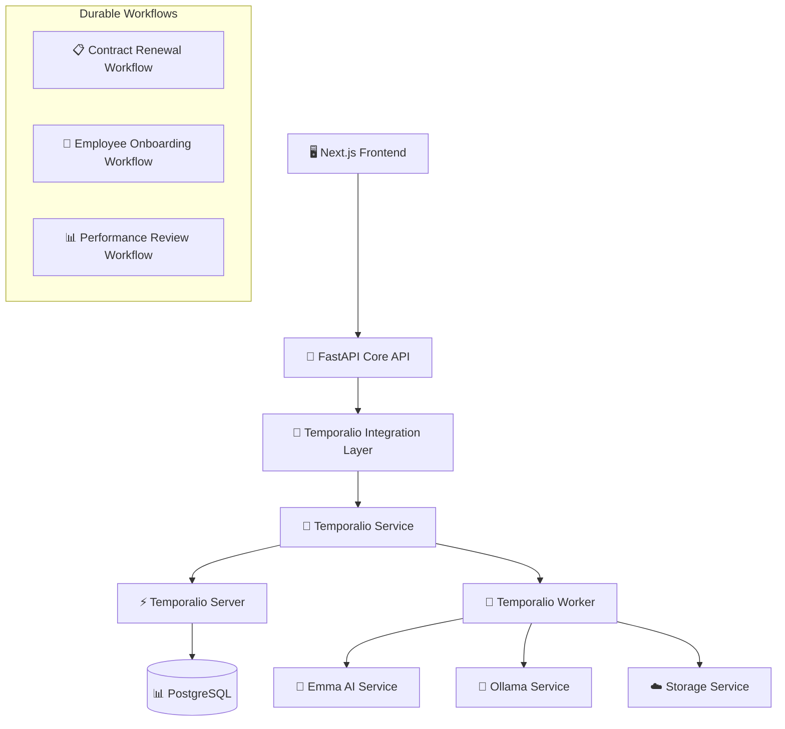

# 🔄 Temporalio Integration - NexusDocs360

## 📋 Integración Completa de Temporalio para Workflows Durables

**NexusDocs360** ahora incluye **Temporalio** como motor de workflows durables, reemplazando la implementación custom BPMN con una solución empresarial robusta y escalable.

---

## 🏗️ Arquitectura de la Integración



---

## 🆕 Componentes Nuevos

### 1. **Temporalio Server** (Puerto 7233/8233)
- **Servidor oficial de Temporalio** para gestión de workflows
- **Web UI** en puerto 8233 para monitoreo visual
- **Persistencia** en PostgreSQL existente
- **Alta disponibilidad** y recuperación automática

### 2. **Temporalio Service** (Puerto 8010)
- **Microservicio personalizado** con FastAPI
- **Workers** que ejecutan workflows y actividades
- **Integración nativa** con Emma AI y servicios existentes
- **Live reloading** para desarrollo

### 3. **Integration Layer** (`/temporalio`)
- **Endpoints REST** en API Core
- **Bridge** entre frontend y Temporalio Service
- **Compatibilidad** con workflows existentes
- **Autenticación** integrada

---

## 🔄 Workflows Implementados

### 1. **Contract Renewal Workflow** ✅
```python
@workflow.defn
class ContractRenewalWorkflow:
    async def run(self, input_data: ContractRenewalInput) -> ContractRenewalResult:
        # 1. Analyze Employee Performance (Emma AI)
        # 2. Evaluate Operational Need (Emma AI)
        # 3. Generate Contract Recommendation (Emma AI)
        # 4. Validate Legal Compliance
        # 5. Generate Documents (Renewal/Termination)
        # 6. Send Notifications to Stakeholders
        # 7. Return Complete Result
```

**Características**:
- ✅ **Durabilidad**: Sobrevive reinicios del sistema
- ✅ **Observabilidad**: Estado visible en tiempo real
- ✅ **Retry Logic**: Reintentos automáticos en fallos
- ✅ **Queries**: Consulta de estado sin interrupción
- ✅ **Signals**: Control dinámico durante ejecución

### 2. **Employee Onboarding Workflow** ✅
```python
@workflow.defn 
class EmployeeOnboardingWorkflow:
    async def run(self, input_data: EmployeeOnboardingInput) -> EmployeeOnboardingResult:
        # 1. Generate Employment Contract
        # 2. Generate Welcome Package
        # 3. Validate Compliance Requirements
        # 4. Setup System Access (Parallel Activities)
        # 5. Schedule Orientation
        # 6. Send Welcome Notifications
        # 7. Calculate Completion Status
```

**Actividades Paralelas**:
- Email account setup
- System permissions configuration
- Equipment ordering
- Workspace preparation

---

## 📡 API Endpoints

### Core Integration (`/api/v1/temporalio`)

```http
POST /temporalio/contract-renewal
POST /temporalio/employee-onboarding
GET  /temporalio/workflow/{workflow_id}/status
POST /temporalio/workflow/{workflow_id}/query
POST /temporalio/workflow/{workflow_id}/cancel
GET  /temporalio/workflows
POST /temporalio/demo/contract-renewal?fast=true
GET  /temporalio/health
```

### Service Direct (`temporalio-service:8010/workflows`)

```http
POST /workflows/start
GET  /workflows/status/{workflow_id}
POST /workflows/query/{workflow_id}
POST /workflows/signal/{workflow_id}
POST /workflows/cancel/{workflow_id}
GET  /workflows/list
POST /workflows/contract-renewal/demo
```

### Service Direct - Visibility (`temporalio-service:8010/workflow-executions`)

```http
GET  /workflow-executions                       # Listado real (Visibility API)
GET  /workflow-executions?status=RUNNING        # Filtrado por estado
GET  /workflow-executions?workflow_type=...     # Filtrado por tipo
GET  /workflow-executions/{workflow_id}/history # Historial de eventos (raw)
```

---

## 🚀 Comandos de Desarrollo

### **Iniciar Stack Completo**
```bash
# Backend con Temporalio
cd backend/docker && ./start-dev.sh

# Frontend
cd frontend && npm run dev
```

### **Verificar Servicios**
```bash
# Health checks
curl http://localhost:8000/temporalio/health          # Integration layer
curl http://localhost:8010/health                     # Temporalio service
curl http://localhost:8233/                           # Temporalio Web UI

# Demo workflow
curl -X POST http://localhost:8000/temporalio/demo/contract-renewal?fast=true
```

### **Monitoreo**
- **Temporalio Web UI**: http://localhost:8233
- **Service Health**: http://localhost:8010/health
- **Integration Health**: http://localhost:8000/temporalio/health

---

## 🔧 Configuración Docker

### **Nuevos Servicios en docker-compose.yml**

```yaml
temporalio-server:
  image: temporalio/auto-setup:1.24.2
  ports:
    - "7233:7233"   # gRPC
    - "8233:8233"   # Web UI
  environment:
    - DB=postgresql
    - POSTGRES_SEEDS=db:5432

temporalio-service:
  build: ../microservices/temporalio-service
  ports:
    - "8010:8010"
  depends_on:
    - temporalio-server
    - weaviate-service
  environment:
    - TEMPORALIO_HOST=temporalio-server
    - TEMPORALIO_NAMESPACE=nexus-workflows
```

### **Variables de Entorno**
```bash
# Temporalio Configuration
TEMPORALIO_HOST=temporalio-server
TEMPORALIO_PORT=7233
TEMPORALIO_NAMESPACE=nexus-workflows
TEMPORALIO_TASK_QUEUE=nexus-workflow-tasks

# Service URLs
TEMPORALIO_SERVICE_URL=http://temporalio-service:8010
```

---

## 🎯 Actividades Especializadas

### **Emma AI Activities**
```python
@activity.defn
async def analyze_employee_performance(contract_data: Dict) -> Dict:
    """Análisis de rendimiento con Emma AI"""

@activity.defn  
async def evaluate_operational_need(contract_data: Dict) -> Dict:
    """Evaluación de necesidad operativa con Emma AI"""

@activity.defn
async def generate_contract_recommendation(analysis_data: Dict) -> Dict:
    """Recomendación final con Emma AI"""
```

### **Document Activities** 
```python
@activity.defn
async def generate_contract_document(contract_data: Dict) -> Dict:
    """Generación de contratos y documentos"""

@activity.defn
async def prepare_termination_documents(termination_data: Dict) -> Dict:
    """Documentos de terminación completos"""
```

### **Validation Activities**
```python
@activity.defn
async def validate_legal_compliance(validation_data: Dict) -> Dict:
    """Validación de cumplimiento legal (España)"""

@activity.defn
async def validate_business_rules(validation_data: Dict) -> Dict:
    """Validación de reglas de negocio"""
```

### **Notification Activities**
```python
@activity.defn
async def notify_stakeholders(notification_data: Dict) -> Dict:
    """Notificaciones multi-stakeholder"""
```

---

## 💡 Ventajas vs Implementación Custom

| Aspecto | Custom BPMN | Temporalio |
|---------|-------------|------------|
| **Durabilidad** | ❌ Estado en memoria | ✅ Persistencia completa |
| **Observabilidad** | ⚠️ Logs básicos | ✅ Web UI + métricas |
| **Escalabilidad** | ❌ Single instance | ✅ Workers distribuidos |
| **Retry Logic** | ⚠️ Manual | ✅ Automático configurable |
| **Versioning** | ❌ Breaking changes | ✅ Backward compatibility |
| **Testing** | ⚠️ Mocking complejo | ✅ Framework de testing |
| **Debugging** | ❌ Difícil | ✅ Step-through debugging |
| **Recovery** | ❌ Pérdida de estado | ✅ Recuperación automática |

---

## 🧪 Testing y Demo

### **Demo Contract Renewal**
```bash
# Fast mode (respuesta inmediata)
curl -X POST "http://localhost:8000/temporalio/demo/contract-renewal?fast=true"

# Full mode (ejecución completa)
curl -X POST "http://localhost:8000/temporalio/demo/contract-renewal?fast=false"
```

**Respuesta Demo**:
```json
{
  "success": true,
  "workflow_id": "contract_renewal_demo_abc12345",
  "status": "running",
  "message": "Demo contract renewal workflow started",
  "demo_type": "temporalio_workflow",
  "architecture_note": "✅ Using Temporalio for durable workflow execution"
}
```

### **Monitorear Progreso**
```bash
# Via Integration API
curl "http://localhost:8000/temporalio/workflow/{workflow_id}/status"

# Query workflow state
curl -X POST "http://localhost:8000/temporalio/workflow/{workflow_id}/query" \
  -H "Content-Type: application/json" \
  -d '{"query_type": "get_workflow_state"}'
```

---

## 📊 Estructura de Archivos

```
backend/
├── microservices/
│   └── temporalio-service/
│       ├── Dockerfile
│       ├── requirements.txt
│       └── app/
│           ├── main.py                    # FastAPI app
│           ├── core/
│           │   ├── config.py             # Settings
│           │   └── temporalio_client.py  # Client management
│           ├── workflows/
│           │   ├── contract_renewal.py   # Contract workflow
│           │   └── employee_onboarding.py # Onboarding workflow
│           ├── activities/
│           │   ├── emma_ai_activities.py      # Emma AI integration
│           │   ├── document_activities.py     # Document generation
│           │   ├── notification_activities.py # Notifications
│           │   └── validation_activities.py   # Legal/business validation
│           ├── workers/
│           │   └── worker_manager.py     # Worker lifecycle
│           └── api/
│               ├── health.py             # Health checks
│               └── workflows.py          # Workflow endpoints
└── app/api/v1/
    └── temporalio_integration.py        # Integration layer
```

---

## 🔄 Migración desde Custom BPMN

### **Antes** (Custom)
```python
# Implementación frágil
result = await bpmn_ai_service.generate_contract_renewal_bpmn(
    contract_data, tenant_id
)
# Estado se pierde si falla el servidor
```

### **Ahora** (Temporalio)
```python
# Implementación durable
handle = await temporalio_client.start_workflow(
    ContractRenewalWorkflow.run,
    input_data,
    id=workflow_id,
    task_queue="nexus-workflow-tasks"
)

# Estado persiste automáticamente
result = await handle.result()  # Puede esperar horas/días
```

### **Compatibilidad**
- ✅ **API endpoints existentes** funcionan sin cambios
- ✅ **Frontend** no requiere modificaciones
- ✅ **Gradual migration** - ambos sistemas pueden coexistir
- ✅ **Fallback** a custom BPMN si Temporalio falla

---

## 🔍 Observabilidad y Debugging

### **Temporalio Web UI** (http://localhost:8233)
- Timeline visual de ejecución
- Estado de cada actividad
- Retry attempts y errores
- Input/output de cada step
- Métricas de performance

### **Workflow Queries**
```python
# Durante ejecución
current_state = await handle.query("get_workflow_state")
execution_log = await handle.query("get_execution_log")

# Progress tracking
progress = await handle.query("get_onboarding_progress")
```

### **Health Monitoring**
```bash
# Service health
curl http://localhost:8010/health

# Integration health  
curl http://localhost:8000/temporalio/health

# Workflow status
curl http://localhost:8000/temporalio/workflow/{id}/status
```

---

## 🎯 Próximos Pasos

### **Phase 1** ✅ (Completado)
- [x] Temporalio Server setup
- [x] Temporalio Service microservicio 
- [x] Contract Renewal workflow
- [x] Employee Onboarding workflow
- [x] Integration layer
- [x] Docker configuration

### **Phase 2** (Próximo)
- [ ] Performance Review workflow
- [ ] Leave Request workflow
- [ ] Disciplinary Process workflow
- [ ] Workflow templates system
- [ ] Advanced scheduling
- [ ] Metrics dashboard

---

## 🧩 Plantillas de Workflow (Consolidación)

- El microservicio ahora intenta consumir plantillas desde el Core (`/api/v1/engine-templates`) usando clave de microservicios.
- Si el Core no está disponible o deniega acceso, hace fallback a plantillas AI locales estáticas.
- Recomendación: exponer en Core un endpoint service-to-service para plantillas (aceptando `X-API-Key`) o que el microservicio lea directamente de la DB compartida.

---

## 🆕 Proceso de Alta para Workflows AI (Catálogo Curado)

Para exponer un flujo AI en el frontend sin manejar JSON a mano:

1. **Definir el template Temporalio**
   - Implementa la lógica en `backend/microservices/temporalio-service/app/data/workflow_templates_ai.py` (o crea el template en la DB estándar).
   - Usa un `template_id` único (`ai-<nombre>-template` recomendado).

2. **Registrar la ficha en el catálogo curado**
   - Edita `backend/app/data/ai_workflow_catalog.py`.
   - Añade una entrada con:
     - `id`: identificador corto mostrado en UI (ej. `ai-legal-advisory`).
     - `template_id`: apunta al template real.
     - `fields`: describe los inputs del formulario (tipos `text`, `textarea`, `select`, `number` con `options`, `placeholder`, etc.).
     - Metadatos opcionales (`tags`, `estimated_duration`, `complexity`).

3. **Normalizar payloads (si aplica)**
   - Si necesitas completar valores calculados, usa `build_workflow_payload()` en el mismo archivo para agregar defaults o transformar datos antes de llamar a Temporalio.

4. **Reiniciar el backend**
   - FastAPI sirve los endpoints `/api/v1/temporalio/ai-workflows` (listado) y `/api/v1/temporalio/ai-workflows/{id}/execute` (instancia).
   - El frontend consume automáticamente el catálogo; basta refrescar la página de “Workflows con Agentes AI”.

5. **Checklist final**
   - Verifica que el template exista (`GET /temporalio/workflow-templates` o `tctl namespace describe`).
   - Confirma que `tenant_id` se resuelve (lo aporta el usuario autenticado si no se incluye en el formulario).
   - Documenta cualquier dependencia adicional (ej. credenciales externas) en la ficha del catálogo.

### **Phase 3** (Futuro)
- [ ] Workflow versioning strategy
- [ ] A/B testing workflows
- [ ] Custom workflow builder UI
- [ ] Integration con servicios externos
- [ ] SLA monitoring
- [ ] Compliance reporting

---

## 🛡️ Aislamiento por Tenant (Search Attributes)

- Los workflows establecen `TenantId` (y `TemplateId`) como Search Attributes al iniciarse.
- Los listados usan filtro por `TenantId` para aislar resultados por organización.

Registro de Search Attributes (una vez por clúster Temporal):

```bash
# Ejemplos usando tctl (Temporal OSS)
tctl --namespace nexus-workflows admin cluster register-search-attribute \
  --name TenantId --type Keyword

tctl --namespace nexus-workflows admin cluster register-search-attribute \
  --name TemplateId --type Keyword

# Opcionales
tctl --namespace nexus-workflows admin cluster register-search-attribute \
  --name WorkflowType --type Keyword
```

Notas:
- Si los atributos no están registrados, los workflows seguirán funcionando pero el filtrado por tenant no se aplicará en Visibility.
- Alternativamente, puede usarse un atributo genérico existente (p. ej. `CustomStringField`), pero se recomienda `TenantId` dedicado.

---

## 🚨 Troubleshooting

### **Temporalio Server no inicia**
```bash
# Verificar PostgreSQL
docker logs docker-db-1

# Verificar configuración
docker logs docker-temporalio-server-1
```

### **Workers no se conectan**
```bash
# Check service logs
docker logs docker-temporalio-service-1

# Verify connectivity
curl http://temporalio-server:7233/
```

### **Workflows fallan**
```bash
# Check worker logs
docker logs docker-temporalio-service-1 --tail 100

# Check activity errors
curl "http://localhost:8010/workflows/status/{workflow_id}"
```

---

**🎉 Temporalio Integration completada exitosamente. Los workflows de NexusDocs360 ahora son durables, observables y escalables.**
