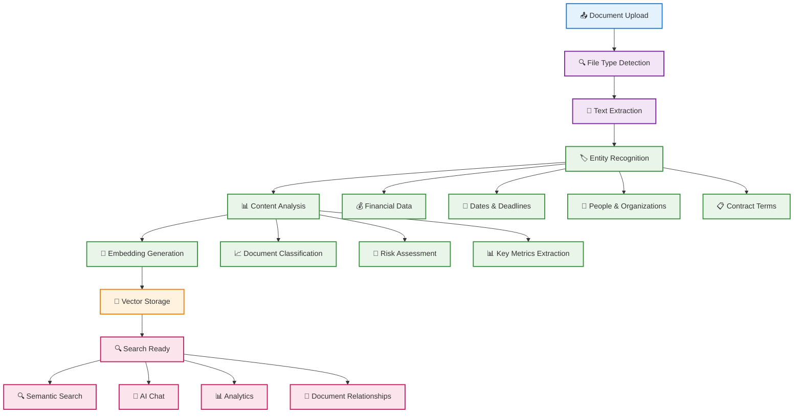

# Pipeline de IA Completo

```mermaid
flowchart TD
    A[📤 Document Upload] --> B[🔍 File Type Detection]
    B --> C[📝 Text Extraction]
    C --> D[🏷️ Entity Recognition]
    D --> E[📊 Content Analysis]
    E --> F[🧮 Embedding Generation]
    F --> G[💾 Vector Storage]
    G --> H[🔍 Search Ready]

    D --> I[💰 Financial Data]
    D --> J[📅 Dates & Deadlines]
    D --> K[👥 People & Organizations]
    D --> L[📋 Contract Terms]

    E --> M[📈 Document Classification]
    E --> N[🎯 Risk Assessment]
    E --> O[📊 Key Metrics Extraction]

    H --> P[🔍 Semantic Search]
    H --> Q[💬 AI Chat]
    H --> R[📊 Analytics]
    H --> S[🔗 Document Relationships]

    classDef input fill:#e3f2fd,stroke:#1976d2,stroke-width:2px
    classDef process fill:#f3e5f5,stroke:#7b1fa2,stroke-width:2px
    classDef ai fill:#e8f5e8,stroke:#388e3c,stroke-width:2px
    classDef storage fill:#fff3e0,stroke:#f57c00,stroke-width:2px
    classDef output fill:#fce4ec,stroke:#c2185b,stroke-width:2px

    class A input
    class B,C process
    class D,E,F ai
    class G storage
    class H,P,Q,R,S output
    class I,J,K,L,M,N,O ai
```