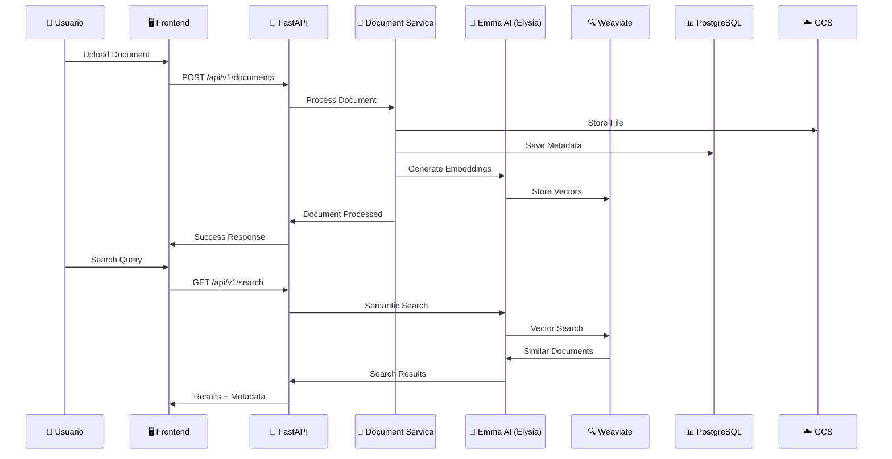

# Flujo de Datos Principal

```mermaid
sequenceDiagram
    participant U as 👤 Usuario
    participant F as 🖥️ Frontend
    participant A as 🚀 FastAPI
    participant D as 📄 Document Service
    participant E as 🤖 Emma AI (Elysia)
    participant W as 🔍 Weaviate
    participant P as 📊 PostgreSQL
    participant G as ☁️ GCS

    U->>F: Upload Document
    F->>A: POST /api/v1/documents
    A->>D: Process Document
    D->>G: Store File
    D->>P: Save Metadata
    D->>E: Generate Embeddings
    E->>W: Store Vectors
    D->>A: Document Processed
    A->>F: Success Response

    U->>F: Search Query
    F->>A: GET /api/v1/search
    A->>E: Semantic Search
    E->>W: Vector Search
    W->>E: Similar Documents
    E->>A: Search Results
    A->>F: Results + Metadata
```