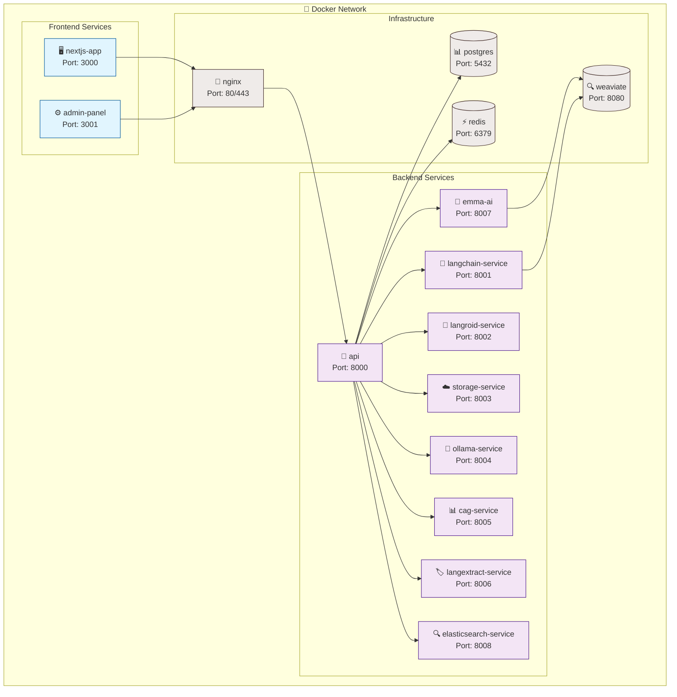

# Arquitectura Docker

```mermaid
graph TB
    subgraph "🐳 Docker Network"
        subgraph "Frontend Services"
            NextJS[🖥️ nextjs-app<br/>Port: 3000]
            Admin[⚙️ admin-panel<br/>Port: 3001]
        end

        subgraph "Backend Services"
            API[🚀 api<br/>Port: 8000]
            Emma[🤖 emma-ai<br/>Port: 8007]
            LangChain[🔗 langchain-service<br/>Port: 8001]
            Langroid[🎯 langroid-service<br/>Port: 8002]
            Storage[☁️ storage-service<br/>Port: 8003]
            Ollama[🦙 ollama-service<br/>Port: 8004]
            CAG[📊 cag-service<br/>Port: 8005]
              LangExtract[🏷️ langextract-service<br/>Port: 8006]
              Elasticsearch[🔍 elasticsearch-service<br/>Port: 8008]
        end

        subgraph "Infrastructure"
            Postgres[(📊 postgres<br/>Port: 5432)]
            Weaviate[(🔍 weaviate<br/>Port: 8080)]
            Redis[(⚡ redis<br/>Port: 6379)]
            Nginx[🔀 nginx<br/>Port: 80/443]
        end
    end

    NextJS --> Nginx
    Admin --> Nginx
    Nginx --> API

      API --> Emma
      API --> LangChain
      API --> Langroid
      API --> Storage
      API --> Ollama
      API --> CAG
      API --> LangExtract
      API --> Elasticsearch

    Emma --> Weaviate
    LangChain --> Weaviate
    API --> Postgres
    API --> Redis

    classDef frontend fill:#e1f5fe,stroke:#01579b
    classDef backend fill:#f3e5f5,stroke:#4a148c
    classDef infra fill:#efebe9,stroke:#3e2723

    class NextJS,Admin frontend
    class API,Emma,LangChain,Langroid,Storage,Ollama,CAG,LangExtract,Elasticsearch backend
    class Postgres,Weaviate,Redis,Nginx infra
```