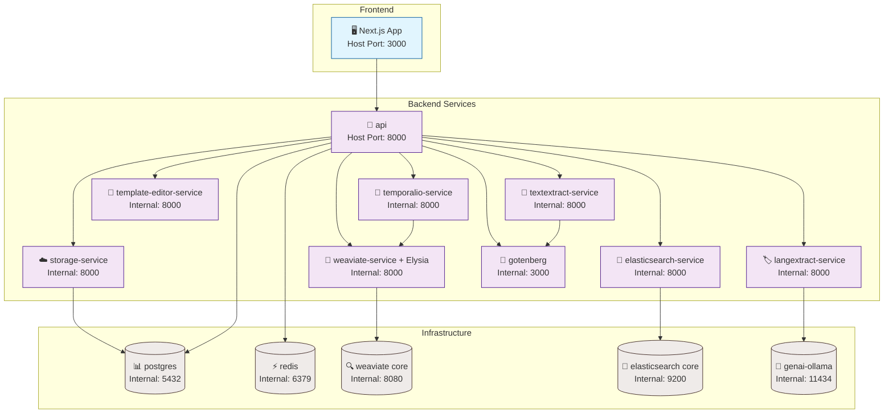

# Arquitectura Docker

> Desde esta iteración solo la API (y las UIs públicas) exponen puertos al host. El resto de microservicios escucha en su puerto interno dentro de `backend-network` y se comunica por DNS (`http://servicio:puerto`).

