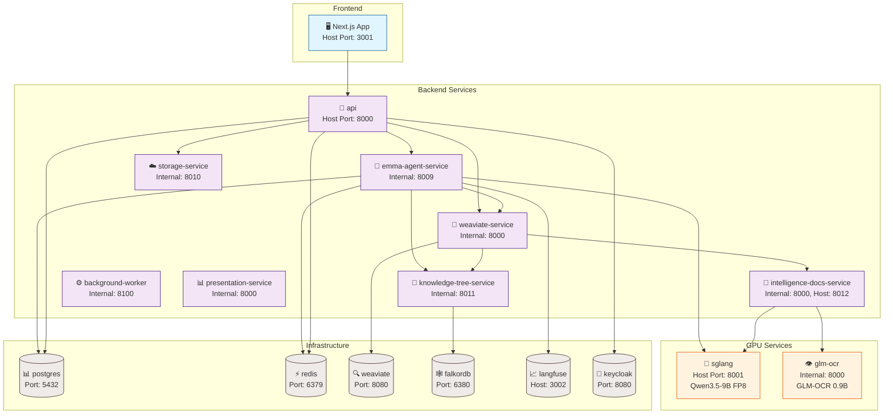

# Arquitectura Docker

> Solo la API, frontend y servicios de proxy exponen puertos al host. El resto de microservicios escucha en su puerto interno dentro de `backend-network` y se comunica por DNS (`http://servicio:puerto`).



## Servicios GPU (RTX 4090 24GB)

| Servicio | VRAM | Modelo | Función |
|----------|------|--------|---------|
| `sglang` | ~14 GB | Qwen3.5-9B FP8 | LLM inference (chat + planner) |
| `intelligence-docs-service` | ~2.7 GB | BGE-M3 | Embeddings 1024 dims |
| `glm-ocr` | ~2 GB | GLM-OCR 0.9B | OCR para documentos escaneados |
| **Total** | **~19 GB** | | Deja ~5 GB para KV cache |

## Flujo de Datos Principal

```
Document Upload → API → weaviate-service (indexing pipeline)
    → intelligence-docs-service (text extraction: Docling/GLM-OCR)
    → intelligence-docs-service (embeddings: BGE-M3)
    → intelligence-docs-service (entity extraction: LangExtract)
    → Weaviate (vector store)
    → FalkorDB (knowledge graph)

User Query → API → emma-agent-service (LangGraph ReAct agent)
    → SGLang (LLM inference)
    → weaviate-service (SmartSearch: Weaviate + FalkorDB + PublicKnowledge)
    → Response with citations
```
