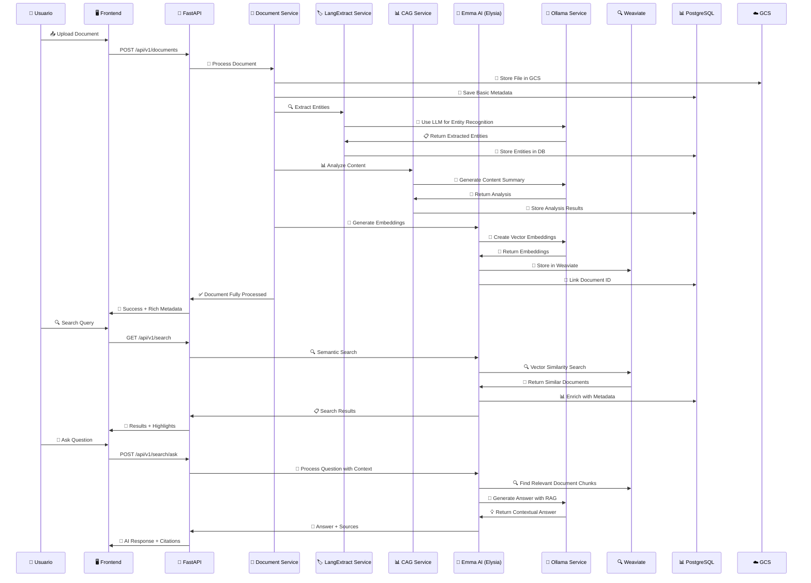

# Flujo de Procesamiento de Documentos con IA

```mermaid
sequenceDiagram
    participant U as 👤 Usuario
    participant F as 🖥️ Frontend
    participant A as 🚀 FastAPI
    participant D as 📄 Document Service
    participant LE as 🏷️ LangExtract Service
    participant CAG as 📊 CAG Service
    participant E as 🤖 Emma AI (Elysia)
    participant O as 🦙 Ollama Service
    participant W as 🔍 Weaviate
    participant P as 📊 PostgreSQL
    participant G as ☁️ GCS

    %% Upload y Procesamiento Inicial
    U->>F: 📤 Upload Document
    F->>A: POST /api/v1/documents
    A->>D: 🔄 Process Document

    %% Almacenamiento
    D->>G: 💾 Store File in GCS
    D->>P: 💾 Save Basic Metadata

    %% Extracción de Entidades (Automática)
    D->>LE: 🔍 Extract Entities
    LE->>O: 🤖 Use LLM for Entity Recognition
    O->>LE: 📋 Return Extracted Entities
    LE->>P: 💾 Store Entities in DB

    %% Análisis de Contenido
    D->>CAG: 📊 Analyze Content
    CAG->>O: 🤖 Generate Content Summary
    O->>CAG: 📝 Return Analysis
    CAG->>P: 💾 Store Analysis Results

    %% Generación de Embeddings
    D->>E: 🧮 Generate Embeddings
    E->>O: 🤖 Create Vector Embeddings
    O->>E: 🔢 Return Embeddings
    E->>W: 💾 Store in Weaviate
    E->>P: 🔗 Link Document ID

    %% Respuesta Final
    D->>A: ✅ Document Fully Processed
    A->>F: 🎉 Success + Rich Metadata

    %% Búsqueda Semántica
    U->>F: 🔍 Search Query
    F->>A: GET /api/v1/search
    A->>E: 🔍 Semantic Search
    E->>W: 🔍 Vector Similarity Search
    W->>E: 📄 Return Similar Documents
    E->>P: 📊 Enrich with Metadata
    E->>A: 📋 Search Results
    A->>F: 🎯 Results + Highlights

    %% Chat con Documentos
    U->>F: 💬 Ask Question
    F->>A: POST /api/v1/search/ask
    A->>E: 🤖 Process Question with Context
    E->>W: 🔍 Find Relevant Document Chunks
    E->>O: 🤖 Generate Answer with RAG
    O->>E: 💡 Return Contextual Answer
    E->>A: 💬 Answer + Sources
    A->>F: 🎯 AI Response + Citations
```