# Arquitectura General del Sistema NexusDocs360

```mermaid
graph TB
    %% Usuarios y Dispositivos
    subgraph "👥 Usuarios"
        User[👤 Usuario Final]
        Admin[👑 Administrador]
        API_Client[🤖 API Client]
    end

    %% Capa de Presentación
    subgraph "🎨 Frontend Layer"
        NextJS[🖥️ Next.js 15<br/>App Router + TypeScript]
        Mobile[📱 Mobile App<br/>React Native]
        AdminUI[⚙️ Admin Dashboard<br/>Shadcn/UI]
    end

    %% API Gateway y Autenticación
    subgraph "🌐 API Gateway"
        Nginx[🔀 Nginx Proxy<br/>SSL + Load Balancer]
        Clerk[🔐 Clerk Auth<br/>OAuth2 + JWT]
        FastAPI[🚀 FastAPI<br/>Main API Gateway]
    end

    %% Servicios de Negocio
    subgraph "⚙️ Business Services"
        DocumentSvc[📄 Document Service<br/>Upload + Processing]
        SearchSvc[🔍 Search Service<br/>Semantic + Hybrid]
        AgentSvc[🤖 Agent Service<br/>AI Conversations]
        SignatureSvc[✍️ Signature Service<br/>Digital Signatures]
        StorageSvc[☁️ Storage Service<br/>GCS Integration]
        AuthSvc[🔒 Auth Service<br/>RBAC + Multi-tenant]
        TeamSvc[👥 Team Service<br/>Collaboration]
        NotificationSvc[📧 Notification Service<br/>Email + Webhooks]
    end

    %% Microservicios de IA
    subgraph "🧠 AI Services"
        WeaviateSvc[🤖 Weaviate + Elysia Service<br/>Internal: 8000]
        LangExtractSvc[🏷️ LangExtract Service<br/>Internal: 8000]
        TextExtractSvc[📑 TextExtract Service<br/>Internal: 8000]
        TemplateSvc[🧩 Template Editor Service<br/>Internal: 8000]
        ElasticSvc[🔎 Elasticsearch Service<br/>Internal: 8000]
        GotenbergSvc[📄 Gotenberg Service<br/>Internal: 3000]
        OllamaSvc[🦙 Ollama Host<br/>Internal: 11434]
    end

    %% Capa de Datos
    subgraph "💾 Data Layer"
        PostgreSQL[(📊 PostgreSQL 15<br/>Main Database<br/>Multi-tenant)]
        Weaviate[(🔍 Weaviate<br/>Vector Database<br/>Semantic Search)]
        Redis[(⚡ Redis<br/>Cache + Sessions)]
        Elasticsearch[(🔎 Elasticsearch<br/>Hybrid Search<br/>Microservice)]
    end

    %% Servicios Externos
    subgraph "🌍 External Services"
        GCS[☁️ Google Cloud Storage<br/>File Storage]
        Stripe[💳 Stripe<br/>Payments]
        SignatureProviders[✍️ Signature Providers<br/>DocuSign, YouSign, etc.]
        EmailSvc[📧 Email Service<br/>SendGrid/Mailgun]
        WebSearch[🌐 Web Search APIs<br/>DuckDuckGo, etc.]
        WeatherAPI[🌤️ Weather APIs<br/>Current conditions]
    end

    %% Conexiones
    User --> NextJS
    Admin --> AdminUI
    API_Client --> Nginx

    NextJS --> Clerk
    AdminUI --> Clerk
    Mobile --> Clerk

    Clerk --> FastAPI
    Nginx --> FastAPI

    FastAPI --> DocumentSvc
    FastAPI --> SearchSvc
    FastAPI --> AgentSvc
    FastAPI --> SignatureSvc
    FastAPI --> StorageSvc
    FastAPI --> AuthSvc
    FastAPI --> TeamSvc
    FastAPI --> NotificationSvc

    DocumentSvc --> TextExtractSvc
    DocumentSvc --> LangExtractSvc
    DocumentSvc --> WeaviateSvc
    DocumentSvc --> GotenbergSvc
    SearchSvc --> WeaviateSvc
    SearchSvc --> ElasticSvc
    AgentSvc --> WeaviateSvc
    TemplateSvc --> StorageSvc
    LangExtractSvc --> OllamaSvc
    WeaviateSvc --> OllamaSvc

    DocumentSvc --> PostgreSQL
    SearchSvc --> PostgreSQL
    AgentSvc --> PostgreSQL
    AuthSvc --> PostgreSQL
    TeamSvc --> PostgreSQL

    WeaviateSvc --> Weaviate
    LangExtractSvc --> Weaviate
    SearchSvc --> Weaviate

    DocumentSvc --> Redis
    SearchSvc --> Redis
    AuthSvc --> Redis

    ElasticSvc --> Elasticsearch

    StorageSvc --> GCS
    SignatureSvc --> SignatureProviders
    NotificationSvc --> EmailSvc

    WeaviateSvc --> WebSearch
    WeaviateSvc --> WeatherAPI

    FastAPI --> Stripe

    %% Estilos
    classDef frontend fill:#e1f5fe,stroke:#01579b,stroke-width:2px
    classDef api fill:#f3e5f5,stroke:#4a148c,stroke-width:2px
    classDef service fill:#e8f5e8,stroke:#1b5e20,stroke-width:2px
    classDef microservice fill:#fff3e0,stroke:#e65100,stroke-width:2px
    classDef database fill:#fce4ec,stroke:#880e4f,stroke-width:2px
    classDef external fill:#efebe9,stroke:#3e2723,stroke-width:2px

    class NextJS,Mobile,AdminUI frontend
    class Nginx,Clerk,FastAPI api
    class DocumentSvc,SearchSvc,AgentSvc,SignatureSvc,StorageSvc,AuthSvc,TeamSvc,NotificationSvc service
    class WeaviateSvc,LangExtractSvc,TextExtractSvc,TemplateSvc,ElasticSvc,GotenbergSvc,OllamaSvc microservice
    class PostgreSQL,Weaviate,Redis,Elasticsearch database
    class GCS,Stripe,SignatureProviders,EmailSvc,WebSearch,WeatherAPI external
```

## Rol de Elysia en la Arquitectura

El bloque `Weaviate + Elysia Service` del diagrama representa la **AI-native database** de Weaviate (Elysia). Esta capa sustituye al antiguo combo “vector DB + motor RAG” y ofrece un stack unificado que incluye:

- **Vectores + embeddings multimodales** (texto, imagen, audio)
- **Documentos crudos y metadata relacional**
- **Motor RAG con indexación híbrida grafo/vector**
- **Seleccionador de herramientas y orquestación de workflows IA**

Elysia se encarga también de gestionar el modelo LLM que se utilizará (Ollama local u OpenAI) leyendo la configuración global (`LLM_PROVIDER`, `LLM_MODEL`, `OPENAI_MODEL`). De esta forma, los servicios de negocio y el API principal solo necesitan “hablar” con `weaviate-service` y no deben duplicar lógica para elegir modelos, gestionar embeddings o buscar documentos.
