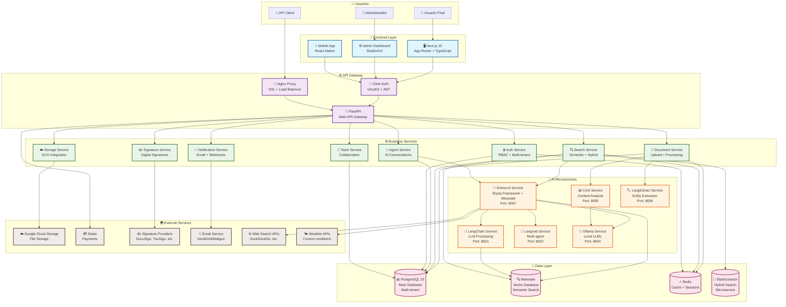

# Arquitectura General del Sistema NexusDocs360

```mermaid
graph TB
    %% Usuarios y Dispositivos
    subgraph "👥 Usuarios"
        User[👤 Usuario Final]
        Admin[👑 Administrador]
        API_Client[🤖 API Client]
    end

    %% Capa de Presentación
    subgraph "🎨 Frontend Layer"
        NextJS[🖥️ Next.js 15<br/>App Router + TypeScript]
        Mobile[📱 Mobile App<br/>React Native]
        AdminUI[⚙️ Admin Dashboard<br/>Shadcn/UI]
    end

    %% API Gateway y Autenticación
    subgraph "🌐 API Gateway"
        Nginx[🔀 Nginx Proxy<br/>SSL + Load Balancer]
        Clerk[🔐 Clerk Auth<br/>OAuth2 + JWT]
        FastAPI[🚀 FastAPI<br/>Main API Gateway]
    end

    %% Servicios de Negocio
    subgraph "⚙️ Business Services"
        DocumentSvc[📄 Document Service<br/>Upload + Processing]
        SearchSvc[🔍 Search Service<br/>Semantic + Hybrid]
        AgentSvc[🤖 Agent Service<br/>AI Conversations]
        SignatureSvc[✍️ Signature Service<br/>Digital Signatures]
        StorageSvc[☁️ Storage Service<br/>GCS Integration]
        AuthSvc[🔒 Auth Service<br/>RBAC + Multi-tenant]
        TeamSvc[👥 Team Service<br/>Collaboration]
        NotificationSvc[📧 Notification Service<br/>Email + Webhooks]
    end

    %% Microservicios de IA
    subgraph "🧠 AI Microservices"
        EmmaAI[🤖 Emma AI Service<br/>Elysia Framework + Weaviate<br/>Port: 8007]
        LangChainSvc[🔗 LangChain Service<br/>LLM Processing<br/>Port: 8001]
        LangroidSvc[🎯 Langroid Service<br/>Multi-agent<br/>Port: 8002]
        OllamaSvc[🦙 Ollama Service<br/>Local LLMs<br/>Port: 8004]
        CAG_Svc[📊 CAG Service<br/>Content Analysis<br/>Port: 8005]
        LangExtractSvc[🏷️ LangExtract Service<br/>Entity Extraction<br/>Port: 8006]
    end

    %% Capa de Datos
    subgraph "💾 Data Layer"
        PostgreSQL[(📊 PostgreSQL 15<br/>Main Database<br/>Multi-tenant)]
        Weaviate[(🔍 Weaviate<br/>Vector Database<br/>Semantic Search)]
        Redis[(⚡ Redis<br/>Cache + Sessions)]
        Elasticsearch[(🔎 Elasticsearch<br/>Hybrid Search<br/>Microservice)]
    end

    %% Servicios Externos
    subgraph "🌍 External Services"
        GCS[☁️ Google Cloud Storage<br/>File Storage]
        Stripe[💳 Stripe<br/>Payments]
        SignatureProviders[✍️ Signature Providers<br/>DocuSign, YouSign, etc.]
        EmailSvc[📧 Email Service<br/>SendGrid/Mailgun]
        WebSearch[🌐 Web Search APIs<br/>DuckDuckGo, etc.]
        WeatherAPI[🌤️ Weather APIs<br/>Current conditions]
    end

    %% Conexiones
    User --> NextJS
    Admin --> AdminUI
    API_Client --> Nginx

    NextJS --> Clerk
    AdminUI --> Clerk
    Mobile --> Clerk

    Clerk --> FastAPI
    Nginx --> FastAPI

    FastAPI --> DocumentSvc
    FastAPI --> SearchSvc
    FastAPI --> AgentSvc
    FastAPI --> SignatureSvc
    FastAPI --> StorageSvc
    FastAPI --> AuthSvc
    FastAPI --> TeamSvc
    FastAPI --> NotificationSvc

    DocumentSvc --> LangExtractSvc
    SearchSvc --> EmmaAI
    AgentSvc --> EmmaAI
    EmmaAI --> LangChainSvc
    EmmaAI --> LangroidSvc
    EmmaAI --> OllamaSvc

    DocumentSvc --> CAG_Svc
    CAG_Svc --> OllamaSvc

    DocumentSvc --> PostgreSQL
    SearchSvc --> PostgreSQL
    AgentSvc --> PostgreSQL
    AuthSvc --> PostgreSQL
    TeamSvc --> PostgreSQL

    EmmaAI --> Weaviate
    LangChainSvc --> Weaviate
    SearchSvc --> Weaviate

    DocumentSvc --> Redis
    SearchSvc --> Redis
    AuthSvc --> Redis

    SearchSvc --> Elasticsearch

    StorageSvc --> GCS
    SignatureSvc --> SignatureProviders
    NotificationSvc --> EmailSvc

    EmmaAI --> WebSearch
    EmmaAI --> WeatherAPI

    FastAPI --> Stripe

    %% Estilos
    classDef frontend fill:#e1f5fe,stroke:#01579b,stroke-width:2px
    classDef api fill:#f3e5f5,stroke:#4a148c,stroke-width:2px
    classDef service fill:#e8f5e8,stroke:#1b5e20,stroke-width:2px
    classDef microservice fill:#fff3e0,stroke:#e65100,stroke-width:2px
    classDef database fill:#fce4ec,stroke:#880e4f,stroke-width:2px
    classDef external fill:#efebe9,stroke:#3e2723,stroke-width:2px

    class NextJS,Mobile,AdminUI frontend
    class Nginx,Clerk,FastAPI api
    class DocumentSvc,SearchSvc,AgentSvc,SignatureSvc,StorageSvc,AuthSvc,TeamSvc,NotificationSvc service
    class EmmaAI,LangChainSvc,LangroidSvc,OllamaSvc,CAG_Svc,LangExtractSvc microservice
    class PostgreSQL,Weaviate,Redis,Elasticsearch database
    class GCS,Stripe,SignatureProviders,EmailSvc,WebSearch,WeatherAPI external
```