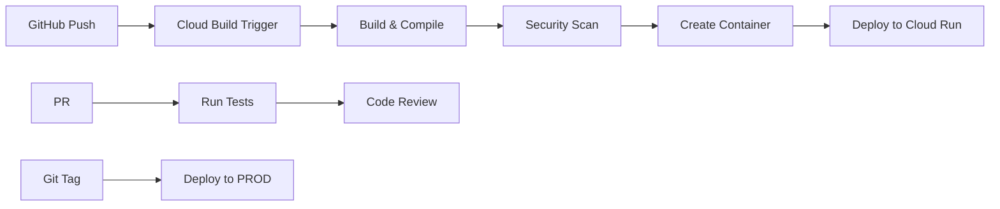

# 🚀 Guía CI/CD con GitHub + Cloud Build

Esta guía configura despliegues automáticos que solo suben código compilado/minificado a GCP.

## 🎯 Arquitectura CI/CD



## 📋 Configuración Paso a Paso

### 1. Preparar Repositorio GitHub

```bash
# En tu repositorio local
cd nexus-document-backend

# Crear branch de desarrollo
git checkout -b develop
git push -u origin develop

# Crear archivos de build
git add deployment/gcp/cloudbuild-trigger-*.yaml
git commit -m "Add Cloud Build configurations for compiled deployments"
git push
```

### 2. Conectar GitHub con Cloud Build

#### Opción A: Desde la Consola (Recomendado)

1. Ir a [Cloud Build Triggers](https://console.cloud.google.com/cloud-build/triggers)
2. Click **"Connect Repository"**
3. Seleccionar **GitHub**
4. Autorizar Cloud Build
5. Seleccionar tu repositorio
6. Click **"Connect"**

#### Opción B: Desde CLI

```bash
# Instalar GitHub app
gcloud beta builds github enterprise connect \
  --project=nexusdocs360-pre

# O usar el script
./deployment/gcp/setup-triggers.sh nexusdocs360/nexusdocs360
```

### 3. Crear Service Account para Builds

```bash
# Crear proyectos GCP primero
# PRE environment
gcloud projects create nexusdocs360-pre --name="NexusDocs360 PRE"

# PROD environment
gcloud projects create nexusdocs360-prod --name="NexusDocs360 PROD"

# Configurar proyecto PRE
gcloud config set project nexusdocs360-pre

# Crear service account
gcloud iam service-accounts create cloud-build-deployer \
  --display-name="Cloud Build Deployer PRE"

# Asignar permisos
PROJECT_ID=nexusdocs360-pre
BUILD_SA=cloud-build-deployer@${PROJECT_ID}.iam.gserviceaccount.com

# Permisos necesarios
for role in \
  roles/run.admin \
  roles/iam.serviceAccountUser \
  roles/storage.admin \
  roles/secretmanager.secretAccessor \
  roles/artifactregistry.admin
do
  gcloud projects add-iam-policy-binding $PROJECT_ID \
    --member="serviceAccount:${BUILD_SA}" \
    --role="$role"
done
```

### 4. Configurar Secrets para Build

```bash
# Crear secrets que necesita el build
echo -n "pk_test_..." | gcloud secrets create clerk-publishable-key-pre --data-file=-
echo -n "pk_test_..." | gcloud secrets create stripe-publishable-key-pre --data-file=-

# Dar acceso a Cloud Build
gcloud secrets add-iam-policy-binding clerk-publishable-key-pre \
  --member="serviceAccount:${PROJECT_NUMBER}@cloudbuild.gserviceaccount.com" \
  --role="roles/secretmanager.secretAccessor"
```

### 5. Crear Triggers

#### Trigger 1: Deploy PRE en push a develop

```bash
gcloud builds triggers create github \
  --repo-name=nexusdocs360 \
  --repo-owner=nexusdocs360 \
  --branch-pattern="^develop$" \
  --build-config=deployment/gcp/cloudbuild-trigger-pre.yaml \
  --name="deploy-pre-develop" \
  --project=nexusdocs360-pre
```

#### Trigger 2: Validar PRs

```bash
gcloud builds triggers create github \
  --repo-name=nexusdocs360 \
  --repo-owner=nexusdocs360 \
  --pull-request-pattern="^.*$" \
  --build-config=deployment/gcp/cloudbuild-pr-validation.yaml \
  --name="validate-pr" \
  --comment-control=COMMENTS_ENABLED \
  --project=nexusdocs360-pre
```

#### Trigger 3: Deploy PROD en tags

```bash
gcloud config set project nexusdocs360-prod

gcloud builds triggers create github \
  --repo-name=nexusdocs360 \
  --repo-owner=nexusdocs360 \
  --tag-pattern="^v[0-9]+\.[0-9]+\.[0-9]+$" \
  --build-config=deployment/gcp/cloudbuild-trigger-prod.yaml \
  --name="deploy-prod-version" \
  --project=nexusdocs360-prod
```

### 6. Configurar Branch Protection

En GitHub, protege las ramas:

1. Ir a **Settings → Branches**
2. Add rule para `main`:
   - ✅ Require PR reviews
   - ✅ Require status checks (Cloud Build)
   - ✅ Require branches up to date
   - ✅ Include administrators

3. Add rule para `develop`:
   - ✅ Require status checks
   - ✅ Require linear history

## 🔄 Flujos de Trabajo

### Desarrollo Normal

```bash
# 1. Crear feature branch
git checkout -b feature/new-feature

# 2. Hacer cambios
# ... código ...

# 3. Commit y push
git add .
git commit -m "Add new feature"
git push origin feature/new-feature

# 4. Crear PR a develop
# Cloud Build valida automáticamente

# 5. Merge a develop
# Deploy automático a PRE
```

### Deploy a Producción

```bash
# 1. Desde main branch
git checkout main
git pull origin main

# 2. Merge develop
git merge develop

# 3. Crear tag de versión
git tag v1.0.0
git push origin main --tags

# Deploy automático a PROD
```

### Rollback de Emergencia

```bash
# Crear tag de rollback
git tag rollback-20240115
git push origin rollback-20240115

# Se activa trigger de rollback
```

## 🔒 Seguridad del Pipeline

### 1. Código Fuente Protegido

Los archivos fuente **NUNCA** se incluyen en las imágenes:

```dockerfile
# ❌ NO se incluyen archivos .py, .ts, .tsx
# ✅ Solo archivos compilados .pyc, .js
```

### 2. Escaneo de Seguridad

Cada build incluye:
- Trufflehog: Busca secretos expuestos
- Safety: Vulnerabilidades en dependencias Python
- npm audit: Vulnerabilidades en dependencias Node
- Trivy: Escaneo de imágenes Docker

### 3. Secretos Seguros

```yaml
# Los secretos se inyectan en build time
secretEnv: ['CLERK_KEY', 'STRIPE_KEY']

# Y se eliminan del código final
RUN rm -rf .env*
```

## 📊 Monitoreo de Builds

### Ver builds en curso

```bash
gcloud builds list --ongoing

# O en la consola
open https://console.cloud.google.com/cloud-build/builds
```

### Ver logs de un build

```bash
gcloud builds log BUILD_ID

# Stream logs
gcloud builds log BUILD_ID --stream
```

### Notificaciones

Configurar notificaciones Slack:

```bash
# Crear Cloud Function para notificaciones
gcloud functions deploy build-notifications \
  --trigger-topic=cloud-builds \
  --runtime=python39 \
  --entry-point=notify_slack \
  --set-env-vars=SLACK_WEBHOOK=https://hooks.slack.com/...
```

## 🎯 Mejores Prácticas

### 1. Versionado Semántico

```bash
# MAJOR.MINOR.PATCH
v1.0.0  # Primera versión estable
v1.0.1  # Bug fixes
v1.1.0  # Nueva funcionalidad
v2.0.0  # Cambios breaking
```

### 2. Commit Messages

```bash
# Formato
type(scope): description

# Ejemplos
feat(auth): add multi-factor authentication
fix(api): resolve memory leak in file upload
docs(readme): update deployment instructions
perf(frontend): optimize bundle size
```

### 3. Estrategia de Branches

```
main
  └── develop
       ├── feature/user-auth
       ├── feature/ai-chat
       └── hotfix/security-patch
```

### 4. Ambientes

- **develop** → PRE (automático)
- **main + tag** → PROD (automático)
- **hotfix** → PRE → PROD (manual)

## 🚨 Troubleshooting

### Build falla con "permission denied"

```bash
# Verificar permisos del service account
gcloud projects get-iam-policy PROJECT_ID \
  --flatten="bindings[].members" \
  --filter="bindings.members:serviceAccount:*@cloudbuild.gserviceaccount.com"
```

### Secretos no encontrados

```bash
# Listar secretos
gcloud secrets list

# Verificar acceso
gcloud secrets get-iam-policy SECRET_NAME
```

### Imagen muy grande

```bash
# Usar multi-stage builds
# Eliminar cache y archivos innecesarios
# Comprimir assets
```

## 📝 Checklist Final

- [ ] GitHub conectado a Cloud Build
- [ ] Service accounts configurados
- [ ] Secrets creados y con permisos
- [ ] Triggers creados (PRE y PROD)
- [ ] Branch protection activado
- [ ] Primer build exitoso en PRE
- [ ] Monitoreo configurado
- [ ] Equipo entrenado en el flujo

---

**¿Problemas?** Revisa los logs en [Cloud Build Console](https://console.cloud.google.com/cloud-build)